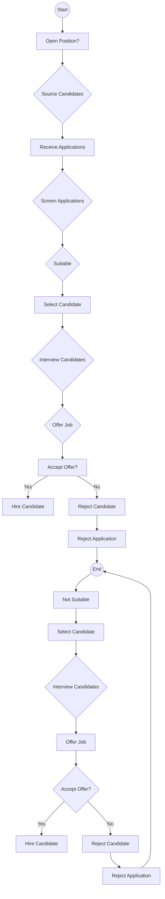

```mermaid
flowchart TD
    Start((Start)) --> A["Open Position?"]
    A --> B{Source Candidates}
    B --> C["Receive Applications"]
    C --> D{Screen Applications}
    D --> E{Suitable}
    E --> F["Select Candidate"]
    F --> G{Interview Candidates}
    G --> H{Offer Job}
    H --> I["Accept Offer?"]
    I -->|Yes| J["Hire Candidate"]
    I -->|No| K["Reject Candidate"]
    K --> L["Reject Application"]
    L --> M((End))
    M --> N["Not Suitable"]
    N --> O["Select Candidate"]
    O --> P{Interview Candidates}
    P --> Q["Offer Job"]
    Q --> R{Accept Offer?}
    R -->|Yes| S["Hire Candidate"]
    R -->|No| T["Reject Candidate"]
    T --> U["Reject Application"]
    U --> M
```