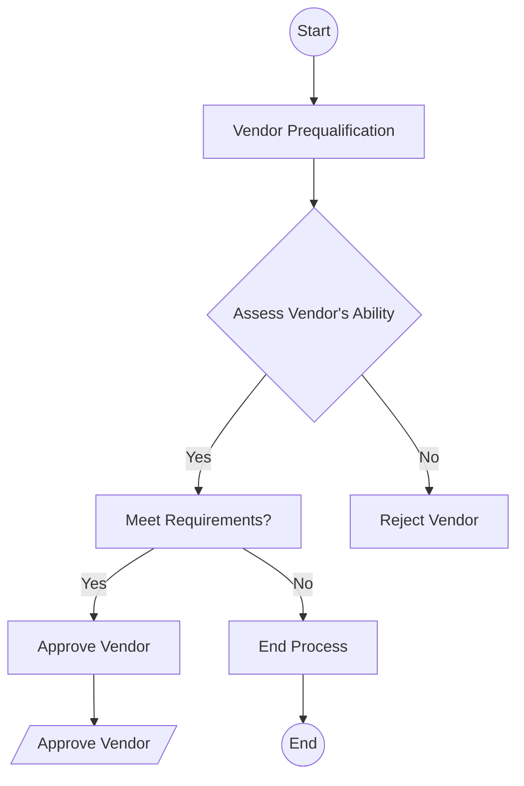

```mermaid
flowchart TD
    A((Start)) --> B["Vendor Prequalification"]
    B --> C{"Assess Vendor's Ability"}
    C -->|Yes| D["Meet Requirements?"]
    C -->|No| E["Reject Vendor"]
    D -->|Yes| F["Approve Vendor"]
    D -->|No| G["End Process"]
    F --> H[/"Approve Vendor"/]
    G --> I((End))
```