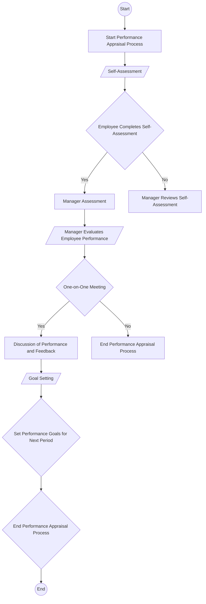

```mermaid
flowchart TD
    A((Start)) --> B["Start Performance Appraisal Process"]
    B --> C[/"Self-Assessment"/]
    C --> D{"Employee Completes Self-Assessment"}
    D -->|Yes| E["Manager Assessment"]
    D -->|No| F["Manager Reviews Self-Assessment"]
    E --> G[/"Manager Evaluates Employee Performance"/]
    G --> H{"One-on-One Meeting"}
    H -->|Yes| I["Discussion of Performance and Feedback"]
    H -->|No| J["End Performance Appraisal Process"]
    I --> K[/"Goal Setting"/]
    K --> L{"Set Performance Goals for Next Period"}
    L --> M{"End Performance Appraisal Process"}
    M --> N((End))
```