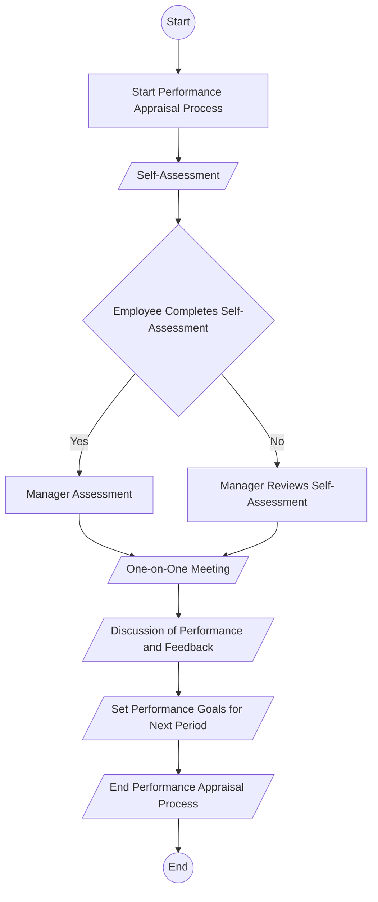

```mermaid
flowchart TD
    A((Start)) --> B["Start Performance Appraisal Process"]
    B --> C[/"Self-Assessment"/]
    C --> D{"Employee Completes Self-Assessment"}
    D -->|Yes| E["Manager Assessment"]
    D -->|No| F["Manager Reviews Self-Assessment"]
    E --> G[/"One-on-One Meeting"/]
    F --> G
    G --> H[/"Discussion of Performance and Feedback"/]
    H --> I[/"Set Performance Goals for Next Period"/]
    I --> J[/"End Performance Appraisal Process"/]
    J --> K((End))
```