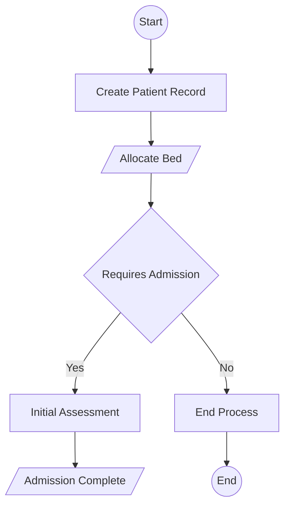

```mermaid
flowchart TD
    A((Start)) --> B["Create Patient Record"]
    B --> C[/"Allocate Bed"/]
    C --> D{"Requires Admission"}
    D -->|Yes| E["Initial Assessment"]
    D -->|No| F["End Process"]
    E --> G[/"Admission Complete"/]
    F --> H((End))
```