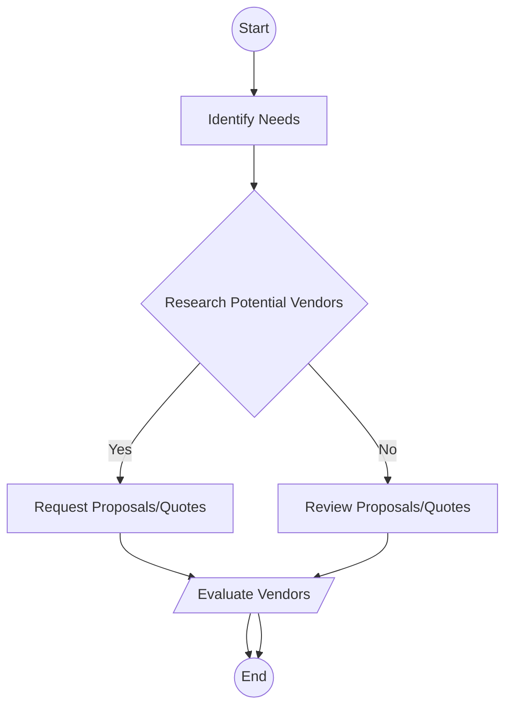

```mermaid
flowchart TD
    Start((Start)) --> A["Identify Needs"]
    A --> B{"Research Potential Vendors"}
    B -->|Yes| C["Request Proposals/Quotes"]
    B -->|No| D["Review Proposals/Quotes"]
    C --> E[/"Evaluate Vendors"/]
    E --> F((End))
    D --> E
    E --> F
```