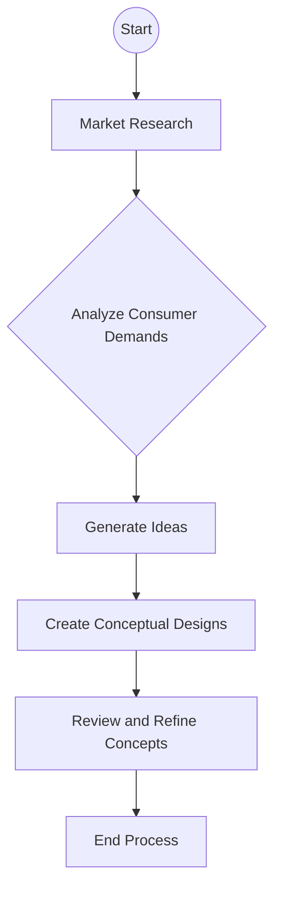

```mermaid
flowchart TD
    A((Start)) --> B["Market Research"]
    B --> C{"Analyze Consumer Demands"}
    C --> D["Generate Ideas"]
    D --> E["Create Conceptual Designs"]
    E --> F["Review and Refine Concepts"]
    F --> G["End Process"]
```