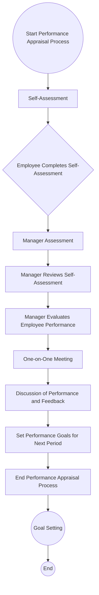

```mermaid
flowchart TD
    Start((Start Performance Appraisal Process)) --> A["Self-Assessment"]
    A --> B{"Employee Completes Self-Assessment"}
    B --> C["Manager Assessment"]
    C --> D["Manager Reviews Self-Assessment"]
    D --> E["Manager Evaluates Employee Performance"]
    E --> F["One-on-One Meeting"]
    F --> G["Discussion of Performance and Feedback"]
    G --> H["Set Performance Goals for Next Period"]
    H --> I["End Performance Appraisal Process"]
    I --> J((Goal Setting))
    J --> K((End))
```