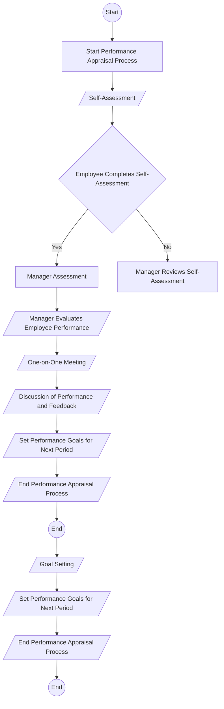

```mermaid
flowchart TD
    A((Start)) --> B["Start Performance Appraisal Process"]
    B --> C[/"Self-Assessment"/]
    C --> D{"Employee Completes Self-Assessment"}
    D -->|Yes| E["Manager Assessment"]
    D -->|No| F["Manager Reviews Self-Assessment"]
    E --> G[/"Manager Evaluates Employee Performance"/]
    G --> H[/"One-on-One Meeting"/]
    H --> I[/"Discussion of Performance and Feedback"/]
    I --> J[/"Set Performance Goals for Next Period"/]
    J --> K[/"End Performance Appraisal Process"/]
    K --> L((End))
    L --> M[/"Goal Setting"/]
    M --> N[/"Set Performance Goals for Next Period"/]
    N --> O[/"End Performance Appraisal Process"/]
    O --> P((End))
```