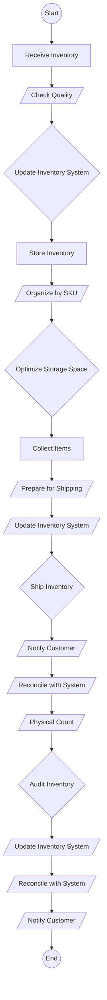

```mermaid
flowchart TD
    A((Start)) --> B["Receive Inventory"]
    B --> C[/"Check Quality"/]
    C --> D{"Update Inventory System"}
    D --> E["Store Inventory"]
    E --> F[/"Organize by SKU"/]
    F --> G{"Optimize Storage Space"}
    G --> H["Collect Items"]
    H --> I[/"Prepare for Shipping"/]
    I --> J[/"Update Inventory System"/]
    J --> K{"Ship Inventory"}
    K --> L[/"Notify Customer"/]
    L --> M[/"Reconcile with System"/]
    M --> N[/"Physical Count"/]
    N --> O{"Audit Inventory"}
    O --> P[/"Update Inventory System"/]
    P --> Q[/"Reconcile with System"/]
    Q --> R[/"Notify Customer"/]
    R --> S((End))
```