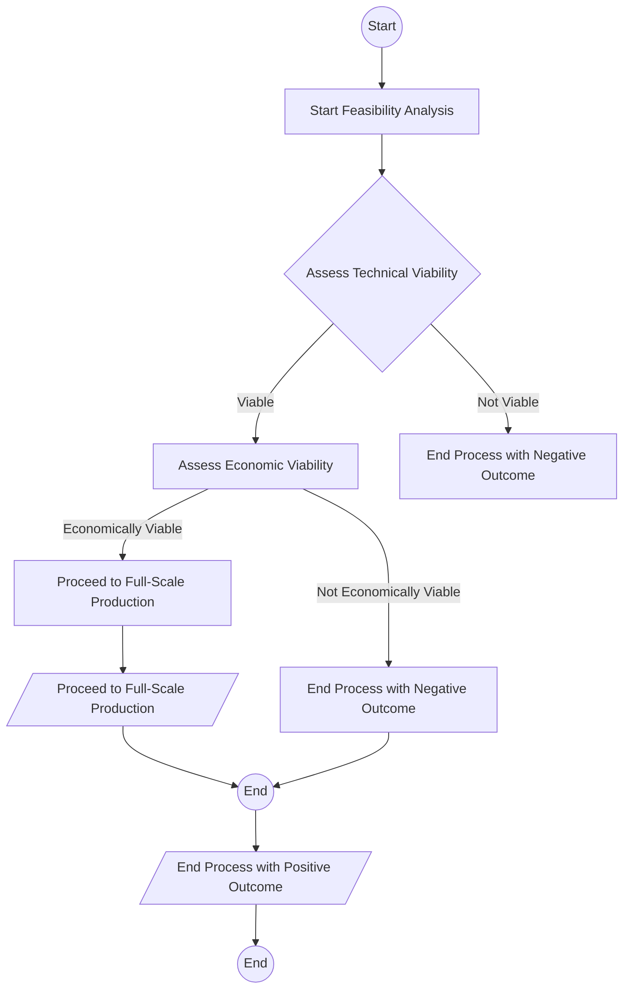

```mermaid
flowchart TD
    A((Start)) --> B["Start Feasibility Analysis"]
    B --> C{Assess Technical Viability}
    C -->|Viable| D["Assess Economic Viability"]
    D -->|Economically Viable| E["Proceed to Full-Scale Production"]
    D -->|Not Economically Viable| F["End Process with Negative Outcome"]
    C -->|Not Viable| G["End Process with Negative Outcome"]
    E --> H[/"Proceed to Full-Scale Production"/]
    H --> I((End))
    F --> I((End))
    I((End)) --> J[/"End Process with Positive Outcome"/]
    J --> K((End))
```