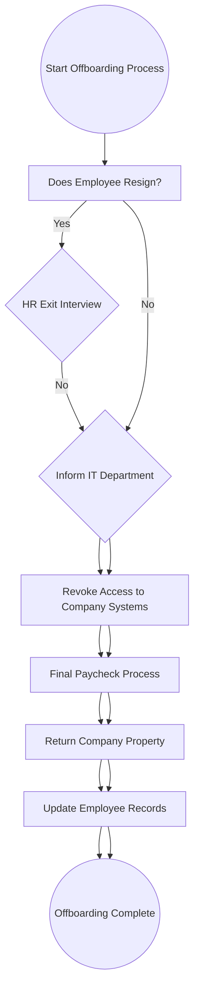

```mermaid
flowchart TD
    Start((Start Offboarding Process)) --> A["Does Employee Resign?"]
    A -->|Yes| B{"HR Exit Interview"}
    B -->|No| C{"Inform IT Department"}
    C --> D["Revoke Access to Company Systems"]
    D --> E["Final Paycheck Process"]
    E --> F["Return Company Property"]
    F --> G["Update Employee Records"]
    G --> H((Offboarding Complete))
    A -->|No| C
    C --> D
    D --> E
    E --> F
    F --> G
    G --> H
```