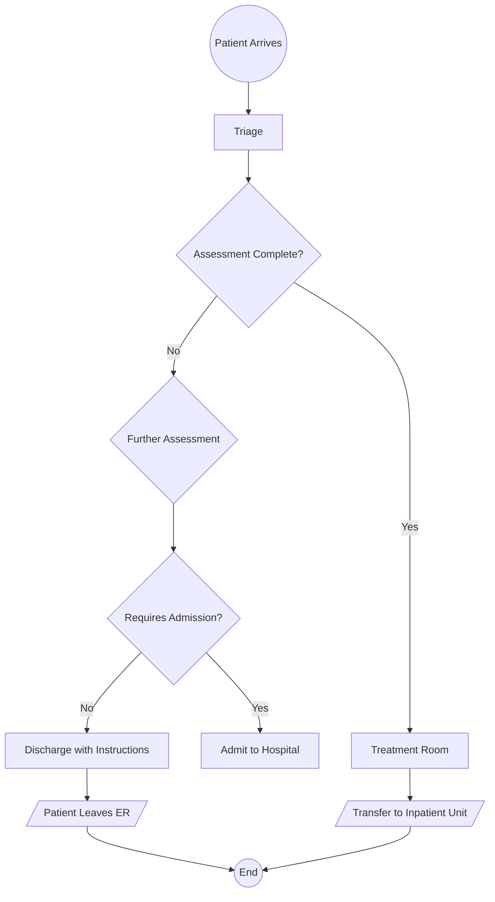

```mermaid
flowchart TD
    A((Patient Arrives)) --> B["Triage"]
    B --> C{"Assessment Complete?"}
    C -->|Yes| D["Treatment Room"]
    C -->|No| E{"Further Assessment"}
    E --> F{"Requires Admission?"}
    F -->|Yes| G["Admit to Hospital"]
    F -->|No| H["Discharge with Instructions"]
    H --> I[/"Patient Leaves ER"/]
    I --> J((End))
    D --> K[/"Transfer to Inpatient Unit"/]
    K --> J
```