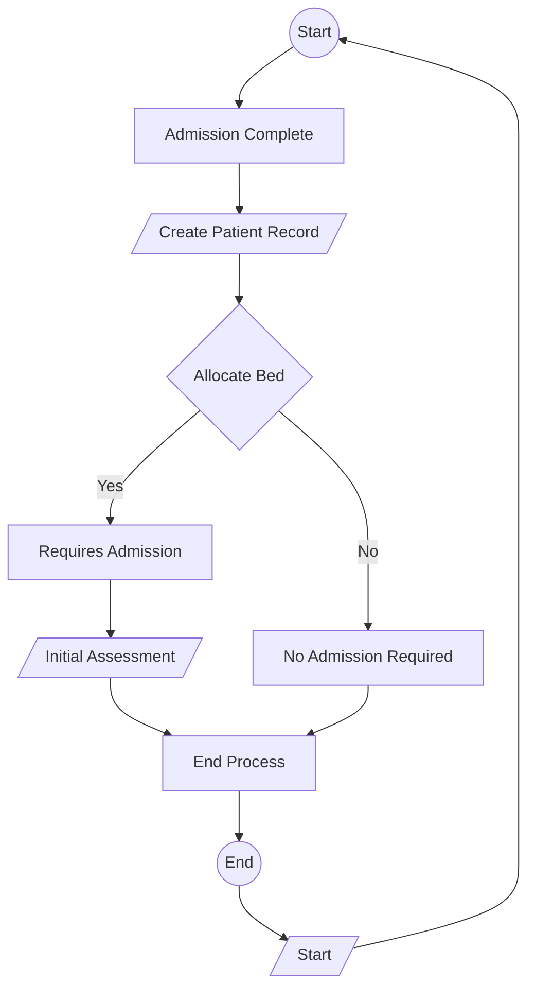

```mermaid
flowchart TD
    A((Start)) --> B["Admission Complete"]
    B --> C[/"Create Patient Record"/]
    C --> D{"Allocate Bed"}
    D -->|Yes| E["Requires Admission"]
    D -->|No| F["No Admission Required"]
    E --> G[/"Initial Assessment"/]
    G --> H["End Process"]
    H --> I((End))
    F --> H
    I --> J[/"Start"/]
    J --> A
```