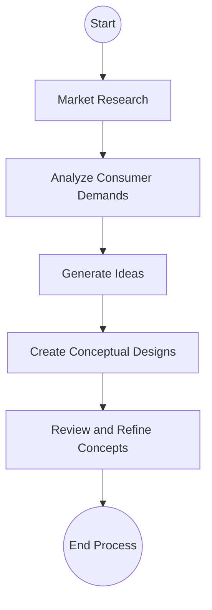

```mermaid
flowchart TD
    Start((Start)) --> Market_Research["Market Research"]
    Market_Research --> Analyze_Consumer_Demands["Analyze Consumer Demands"]
    Analyze_Consumer_Demands --> Generate_Ideas["Generate Ideas"]
    Generate_Ideas --> Create_Conceptual_Designs["Create Conceptual Designs"]
    Create_Conceptual_Designs --> Review_and_Refine_Concepts["Review and Refine Concepts"]
    Review_and_Refine_Concepts --> End_Process((End Process))
```