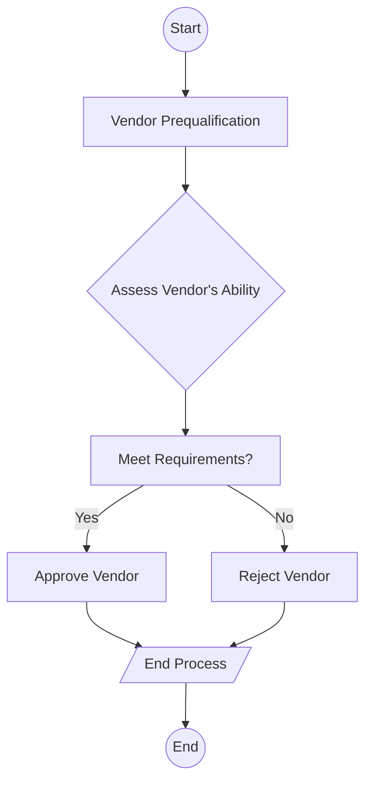

```mermaid
flowchart TD
    Start((Start)) --> A["Vendor Prequalification"]
    A --> B{"Assess Vendor's Ability"}
    B --> C["Meet Requirements?"]
    C -->|Yes| D["Approve Vendor"]
    C -->|No| E["Reject Vendor"]
    D --> F[/"End Process"/]
    E --> F
    F --> G((End))
```