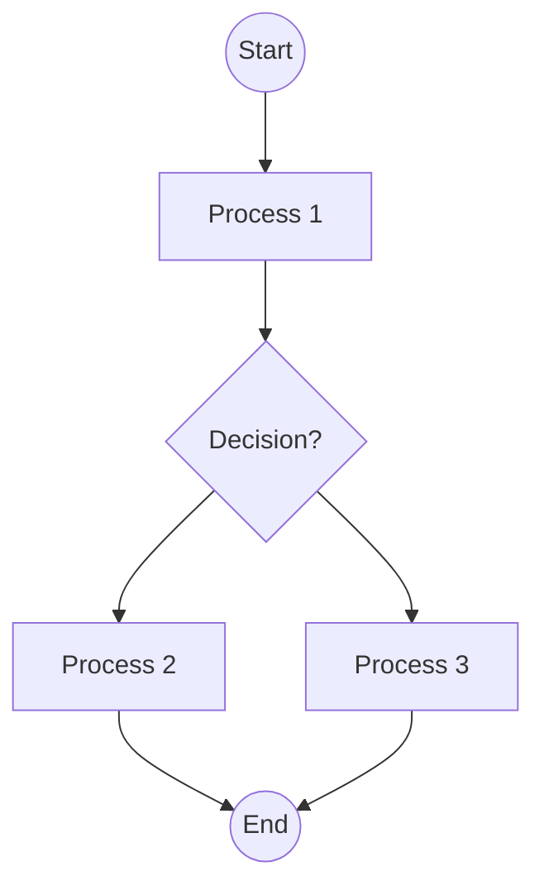

user

## Analyze the flowchart image and convert it to Mermaid syntax.

Follow these requirements strictly:

1. Use proper Mermaid flowchart syntax starting with 'flowchart TD' (top-down) or 'flowchart LR' (left-right)
2. Identify all nodes/boxes and give them appropriate IDs (A, B, C, etc.)
3. Include all decision diamonds with proper syntax using {condition?}
4. Add all connecting arrows and labels using ONLY '-->' (not '-- >' or other variations)
5. Use appropriate node shapes:
   - [Text] for process boxes
   - {Text} for decision diamonds  
   - ((Text)) for start/end circles
   - [Text] for regular rectangles
6. Include all text labels exactly as shown in the image
7. Ensure proper flow direction and connections

IMPORTANT MERMAID SYNTAX RULES:
- Always use '-->' for arrows (never '-- >')
- Node IDs must be followed immediately by node content: A[Process] or B{Decision?}
- Decision nodes use curly braces: {Is condition met?}
- Start/End nodes use double parentheses: ((Start)) or ((End))
- Process nodes use square brackets: [Do something]
- No spaces in arrow syntax: A --> B (not A -- > B)

EXAMPLE:

Provide only the Mermaid code without any additional explanation.assistant

flowchart TD
    A((Start)) --> B[Locate the Bubble Witch Saga App]
    B --> C[User identifies the app icon]
    C --> D[Open the App]
    D --> E[App is launched]
    E --> F[Access Settings]
    F --> G[Settings screen is opened]
    G --> H{Sound effects ticked?}
    H -->|Yes| I[Untick 'Sound effects']
    H -->|No| J[Sound effects are mutec]
    I --> K[Sound effects remain mutec]
    J --> L{Music option ticked?}
    L -->|Yes| M[Untick 'Music']
    L -->|No| N[Music is turned off]
    M --> O[Music remains turned off]
    N --> O
    O --> P[Save Settings and Exit]
    P --> Q[Settings are saved and exit to game]
    Q --> R((End))