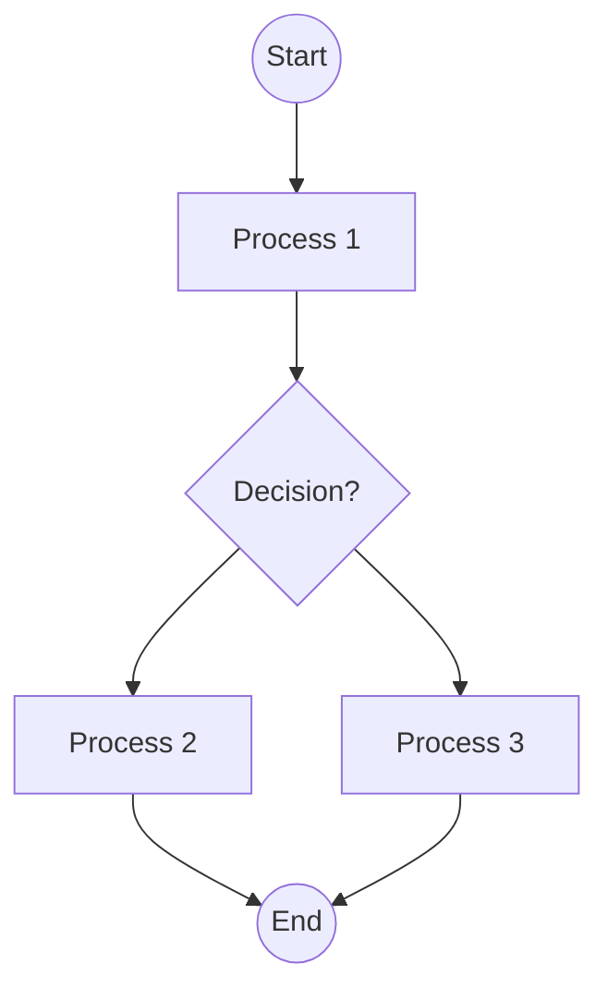

user

## Analyze the flowchart image and convert it to Mermaid syntax.

Follow these requirements strictly:

1. Use proper Mermaid flowchart syntax starting with 'flowchart TD' (top-down) or 'flowchart LR' (left-right)
2. Identify all nodes/boxes and give them appropriate IDs (A, B, C, etc.)
3. Include all decision diamonds with proper syntax using {condition?}
4. Add all connecting arrows and labels using ONLY '-->' (not '-- >' or other variations)
5. Use appropriate node shapes:
   - [Text] for process boxes
   - {Text} for decision diamonds  
   - ((Text)) for start/end circles
   - [Text] for regular rectangles
6. Include all text labels exactly as shown in the image
7. Ensure proper flow direction and connections

IMPORTANT MERMAID SYNTAX RULES:
- Always use '-->' for arrows (never '-- >')
- Node IDs must be followed immediately by node content: A[Process] or B{Decision?}
- Decision nodes use curly braces: {Is condition met?}
- Start/End nodes use double parentheses: ((Start)) or ((End))
- Process nodes use square brackets: [Do something]
- No spaces in arrow syntax: A --> B (not A -- > B)

EXAMPLE:

Provide only the Mermaid code without any additional explanation.assistant

flowchart TD
    A1(["Start"]) --> A2[/"Determine the district for the wedding"/]
    A2 --> A3[/"Residency Requirement: 1- wedding"/]
    A3 --> A4{/"Check district residency requirements"/}
    A4 --> A5[/"Having a church wedding"/]
    A5 --> A6{/"District requirements apply to church weddings?"/}
    A6 --> A7[/"Comply with district church wedding"/]
    A7 --> A8{/"Residency may not apply to church weddings"/}
    A8 --> A9[/"Choose Region/Process"/]
    A9 --> A10[/"Ceremony Off or Prescribed"/]
    A10 --> A11{/"Ceremony Roman Catholic?"/}
    A11 --> A12[/"Wedding by Roman Catholic register"/]
    A12 --> A13{/"Either party divorced?"/}
    A13 --> A14[/"Gather required documents"/]
    A14 --> A15{/"Present documents to registrar"/]
    A15 --> A16[/"Roman Catholic ceremony performed"/]
    A16 --> A17{/"Can marry in another church or civil ceremony"/}
    A17 --> A18[/"Consider not ceremony"/]
    A18 --> A19{/"Additional docs or clarification needed"/]
    A19 --> A20[/"Wedding in regional and scheduled"/]
    A20 --> A21{/"Proceed with Roman Catholic ceremony"/}
    A21 --> A22[/"Error in ceremony type selection"/]
    A22 --> A23(["End"])