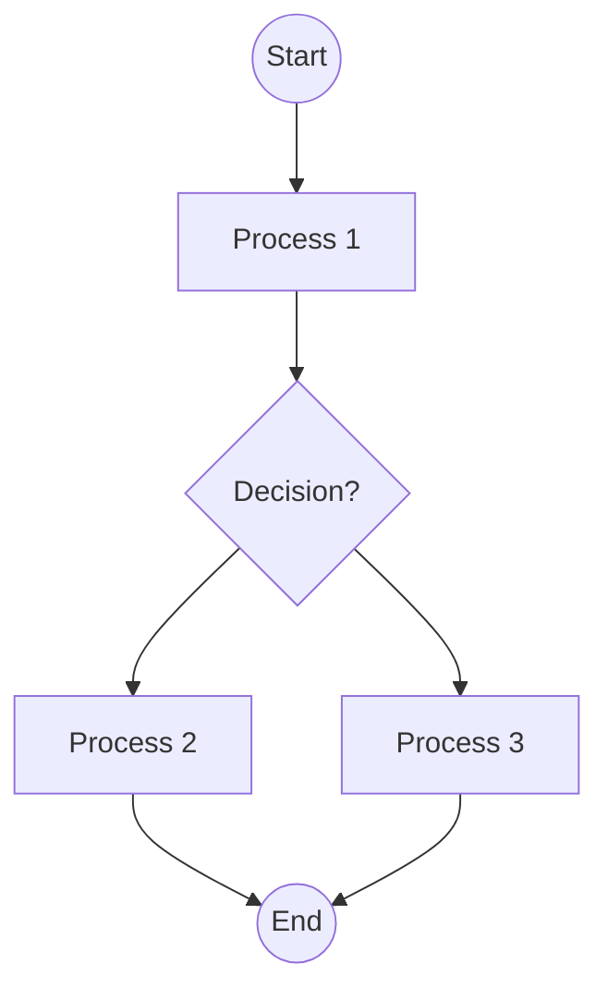

user

## Analyze the flowchart image and convert it to Mermaid syntax.

Follow these requirements strictly:

1. Use proper Mermaid flowchart syntax starting with 'flowchart TD' (top-down) or 'flowchart LR' (left-right)
2. Identify all nodes/boxes and give them appropriate IDs (A, B, C, etc.)
3. Include all decision diamonds with proper syntax using {condition?}
4. Add all connecting arrows and labels using ONLY '-->' (not '-- >' or other variations)
5. Use appropriate node shapes:
   - [Text] for process boxes
   - {Text} for decision diamonds  
   - ((Text)) for start/end circles
   - [Text] for regular rectangles
6. Include all text labels exactly as shown in the image
7. Ensure proper flow direction and connections

IMPORTANT MERMAID SYNTAX RULES:
- Always use '-->' for arrows (never '-- >')
- Node IDs must be followed immediately by node content: A[Process] or B{Decision?}
- Decision nodes use curly braces: {Is condition met?}
- Start/End nodes use double parentheses: ((Start)) or ((End))
- Process nodes use square brackets: [Do something]
- No spaces in arrow syntax: A --> B (not A -- > B)

EXAMPLE:


Provide only the Mermaid code without any additional explanation.assistant

```mermaid
flowchart TD
    A((Start)) --> B[Add 1-1/2 C Warm Water]
    B --> C[Add 1 Tbsp Sugar]
    C --> D[Add 1 Packet Yeast]
    D --> E[Mix water, sugar, and yeast and let sit for 10 minutes.]
    E --> F[Add 1 tsp Salt]
    F --> G[Add 1 Tbsp Oil or Butter]
    G --> H{Add 2 C Flour}
    H --> I[Stir in salt, oil/butter, and 2 cups of flour.]
    I --> J[Add Additional Flour (up to 4 1/2 C total)]
    J --> K{Stir in as much flour as possible.}
    K --> L[Turn dough onto a floured board.]
    L --> M[Knead for 7 to 8 minutes, adding flour as necessary.]
    M --> N{Is baking soda added to the dough?}
    N --> O[Place dough in a lightly oiled bowl.]
    O --> P[Rest dough in a warm place for 1 hour.]
    P --> Q[Add 8 C Water]
    Q --> R[Bring water and baking soda to a boil in a large heat oven to 450F.]
    R --> S[Punch down dough after rest.]
    S --> T[Divide dough into 16 equal pieces.]
    T --> U[Roll each piece into a rope 16 to 20 inches long.]
    U --> V[Form each rope into a pretzel shape.]
    V --> W[Place pretzels directly into a boiling baking soda solution.]
    W --> X[Boil or dip the pretzels]
    X --> Y{Boil or dip the pretzels]
    Y --> Z[Transfer pretzels to cooling rack.]
    Z --> ((End))
    ((End)) --> ((Start))
```