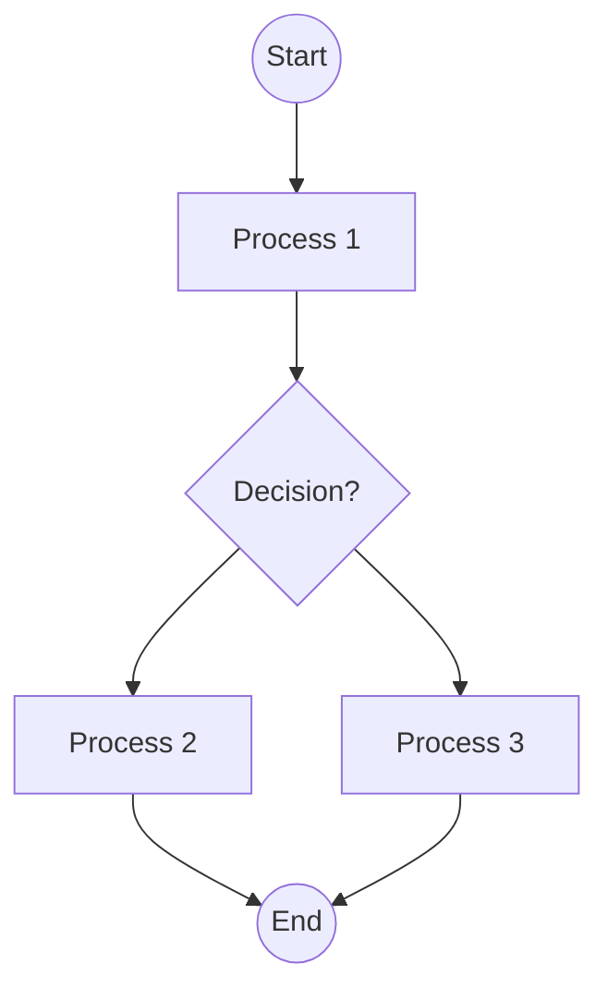

user

## Analyze the flowchart image and convert it to Mermaid syntax.

Follow these requirements strictly:

1. Use proper Mermaid flowchart syntax starting with 'flowchart TD' (top-down) or 'flowchart LR' (left-right)
2. Identify all nodes/boxes and give them appropriate IDs (A, B, C, etc.)
3. Include all decision diamonds with proper syntax using {condition?}
4. Add all connecting arrows and labels using ONLY '-->' (not '-- >' or other variations)
5. Use appropriate node shapes:
   - [Text] for process boxes
   - {Text} for decision diamonds  
   - ((Text)) for start/end circles
   - [Text] for regular rectangles
6. Include all text labels exactly as shown in the image
7. Ensure proper flow direction and connections

IMPORTANT MERMAID SYNTAX RULES:
- Always use '-->' for arrows (never '-- >')
- Node IDs must be followed immediately by node content: A[Process] or B{Decision?}
- Decision nodes use curly braces: {Is condition met?}
- Start/End nodes use double parentheses: ((Start)) or ((End))
- Process nodes use square brackets: [Do something]
- No spaces in arrow syntax: A --> B (not A -- > B)

EXAMPLE:


Provide only the Mermaid code without any additional explanation.assistant

```mermaid
flowchart TD
    A((Start)) --> B[Find an International Texting App]
    B --> C[Open the App Store, Google Play, or Windows Store]
    C --> D[Search for 'International call/text']
    D --> E[Discover Apps like WhatsApp, Viber, etc.]
    E --> F[Select a desired international texting app]
    F --> G[Download and install the app]
    G --> H[Enter International Phone Number]
    H --> I[Open the installed app]
    I --> J[Enter your international phone number]
    J --> K[The app now knows where to receive messages]
    K --> L[Did you receive a verification code via SMS?]
    L[Is there an option to receive the code via email?] --> M[Select email verification code]
    M --> N[Recheck the phone number and try again]
    N --> O[Input the verification code]
    O --> P[The app is ready to send international SMS]
    P --> Q[Does the app ask for permission to access contacts?]
    Q --> R[Go to app settings]
    R --> S[Click yes to import contact]
    S --> T[Do you have an internet connection?]
    T --> U[Access the messaging interface within the app]
    U --> V[Start a conversation, send text, pictures, emojis, etc.]
    V --> W[Send messages anywhere in the world for free]
    W --> X[Establish an internet connection to use the service]
    X --> Y[Do you have an internet connection?]
    Y --> Z[Select email verification code]
    Z --> ((End))
```