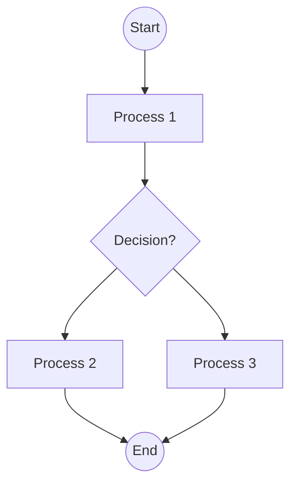

user

## Analyze the flowchart image and convert it to Mermaid syntax.

Follow these requirements strictly:

1. Use proper Mermaid flowchart syntax starting with 'flowchart TD' (top-down) or 'flowchart LR' (left-right)
2. Identify all nodes/boxes and give them appropriate IDs (A, B, C, etc.)
3. Include all decision diamonds with proper syntax using {condition?}
4. Add all connecting arrows and labels using ONLY '-->' (not '-- >' or other variations)
5. Use appropriate node shapes:
   - [Text] for process boxes
   - {Text} for decision diamonds  
   - ((Text)) for start/end circles
   - [Text] for regular rectangles
6. Include all text labels exactly as shown in the image
7. Ensure proper flow direction and connections

IMPORTANT MERMAID SYNTAX RULES:
- Always use '-->' for arrows (never '-- >')
- Node IDs must be followed immediately by node content: A[Process] or B{Decision?}
- Decision nodes use curly braces: {Is condition met?}
- Start/End nodes use double parentheses: ((Start)) or ((End))
- Process nodes use square brackets: [Do something]
- No spaces in arrow syntax: A --> B (not A -- > B)

EXAMPLE:


Provide only the Mermaid code without any additional explanation.assistant

```mermaid
flowchart TD
    A((Start)) --> B[Assess if additional vehicle weight is needed]
    B --> C{Is vehicle weight sufficient}
    C --> D[Add weight to the vehicle]
    D --> E{Determine type of transmission}
    E --> F{Is the transmission manual (M/T)?}
    F --> G[Put gear to (1)]
    G --> H[Put transmission to (+-) and set to first gear]
    H --> I[Keep throttle/acceleration balanced and high]
    I --> J[Engine growling to prevent water in exhaust]
    J --> K{Is the transmission manual (M/T)?}
    K --> L[Press and maintain the clutch]
    L --> M[Drive carefully through the flood]
    M --> N[Observe and visualize the area around]
    N --> O[Check mirrors for situational awareness]
    O --> P[After driving through, perform a vehicle check]
    P --> Q{Is technical assistance required?}
    Q --> R[Contact the vehicle technician]
    R --> S[Assessment of vehicle condition post-flood]
    S --> T[Stay calm throughout the situation]
    T --> U[Controlled response to flood driving]
    U --> V[End]
    V --> W{Is the transmission manual (M/T)?}
    W --> X[Press and maintain the clutch]
    X --> Y[Drive carefully through the flood]
    Y --> Z[Observe and visualize the area around]
    Z --> AA[Check mirrors for situational awareness]
    AA --> BB[After driving through, perform a vehicle check]
    BB --> CC{Is technical assistance required?}
    CC --> DD[Contact the vehicle technician]
    DD --> EE[Assessment of vehicle condition post-flood]
    EE --> FF[Stay calm throughout the situation]
    FF --> GG[Controlled response to flood driving]
    GG --> HH[End]
    HH --> II{Is the transmission manual (M/T)?}
    II --> JJ[Press and maintain the clutch]
    JJ --> KK[Drive carefully through the flood]
    KK --> LL[Observe and visualize the area around]
    LL --> MM[Check mirrors for situational awareness]
    MM --> NN[After driving through, perform a vehicle check]
    NN --> OO{Is technical assistance required?}
    OO --> PP[Contact the vehicle technician]
    PP --> QQ[Assessment of vehicle condition post-flood]
    QQ --> RR[Stay calm throughout the situation]
    RR --> SS[Controlled response to flood driving]
    SS --> TT[End]
    TT --> UU{Is the transmission manual (M/T)?}
    UU --> VV[Press and maintain the clutch]
    VV --> WW[Drive carefully through the flood]
    WW --> XX[Observe and visualize the area around]
   