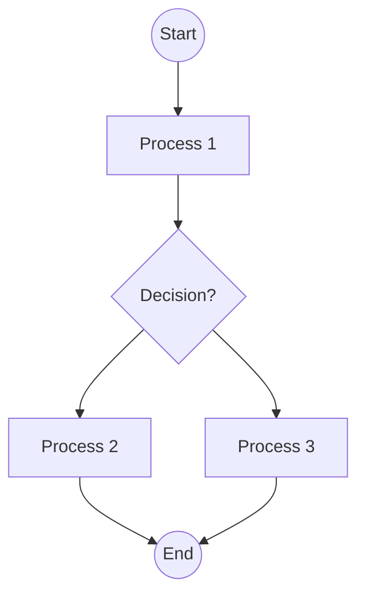

user

## Analyze the flowchart image and convert it to Mermaid syntax.

Follow these requirements strictly:

1. Use proper Mermaid flowchart syntax starting with 'flowchart TD' (top-down) or 'flowchart LR' (left-right)
2. Identify all nodes/boxes and give them appropriate IDs (A, B, C, etc.)
3. Include all decision diamonds with proper syntax using {condition?}
4. Add all connecting arrows and labels using ONLY '-->' (not '-- >' or other variations)
5. Use appropriate node shapes:
   - [Text] for process boxes
   - {Text} for decision diamonds  
   - ((Text)) for start/end circles
   - [Text] for regular rectangles
6. Include all text labels exactly as shown in the image
7. Ensure proper flow direction and connections

IMPORTANT MERMAID SYNTAX RULES:
- Always use '-->' for arrows (never '-- >')
- Node IDs must be followed immediately by node content: A[Process] or B{Decision?}
- Decision nodes use curly braces: {Is condition met?}
- Start/End nodes use double parentheses: ((Start)) or ((End))
- Process nodes use square brackets: [Do something]
- No spaces in arrow syntax: A --> B (not A -- > B)

EXAMPLE:


Provide only the Mermaid code without any additional explanation.assistant

```mermaid
flowchart TD
    A((Start)) --> B[Create a list of'must-have' features for the dresses]
    B --> C{Agree on color, length, style, and material for the dresses}
    C --> D{Has the bride chosen a specific color or shade?}
    D --> E[Is the disliked dress selected by someone else?]
    E --> F{Offer constructive feedback}
    F --> G{Is the disliked dress selected by the bride?}
    G --> H[Search for an alternative dress that meets the bride's requirements]
    H --> I{Allow bridesmaids to select their own dresses within that color}
    I --> J{Bridesmaids take into account personal factors when selecting a dress}
    J --> K{Require bridesmaids to get approval for dress selection}
    K --> L{Ensure bridesmaids get the bride's approval before purchase}
    L --> M{Maintain a record of approved dresses}
    M --> N{Align the mother-of-the-bride dress with the wedding party's color}
    N --> O{A cohesive look for the wedding party with the mother-of-the-bride included}
    O --> P[End]
    C --> P
    D --> P
    E --> P
    G --> P
    H --> P
    I --> P
    J --> P
    K --> P
    L --> P
    M --> P
    N --> P
    P --> ((End))
```