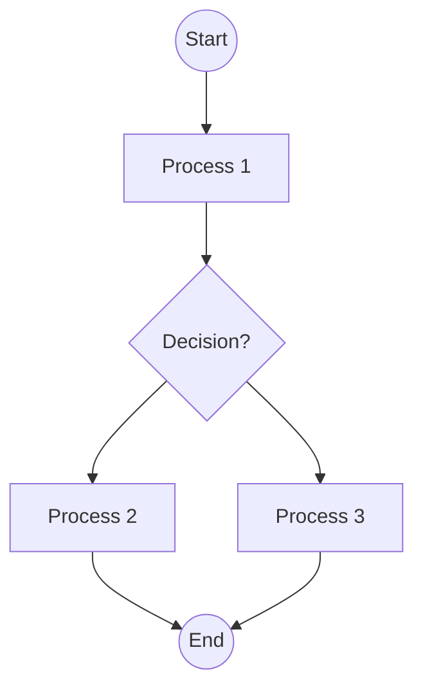

user

## Analyze the flowchart image and convert it to Mermaid syntax.

Follow these requirements strictly:

1. Use proper Mermaid flowchart syntax starting with 'flowchart TD' (top-down) or 'flowchart LR' (left-right)
2. Identify all nodes/boxes and give them appropriate IDs (A, B, C, etc.)
3. Include all decision diamonds with proper syntax using {condition?}
4. Add all connecting arrows and labels using ONLY '-->' (not '-- >' or other variations)
5. Use appropriate node shapes:
   - [Text] for process boxes
   - {Text} for decision diamonds  
   - ((Text)) for start/end circles
   - [Text] for regular rectangles
6. Include all text labels exactly as shown in the image
7. Ensure proper flow direction and connections

IMPORTANT MERMAID SYNTAX RULES:
- Always use '-->' for arrows (never '-- >')
- Node IDs must be followed immediately by node content: A[Process] or B{Decision?}
- Decision nodes use curly braces: {Is condition met?}
- Start/End nodes use double parentheses: ((Start)) or ((End))
- Process nodes use square brackets: [Do something]
- No spaces in arrow syntax: A --> B (not A -- > B)

EXAMPLE:

Provide only the Mermaid code without any additional explanation.assistant

flowchart TD
    A((Start)) --> B[Assess External Threats]
    B --> C{Potential predators present?}
    C -->|Yes| D[Protect rabbit from predators]
    C -->|No| E[Evaluate Plant Safety]
    D --> F((End))
    E --> G[All plants safe?]
    G -->|Yes| H[Plants are safe]
    G -->|No| I[Remove hazardous plants]
    H --> J[Rabbit handled carefully?]
    I --> J
    J -->|Yes| K[Reduced risk of injury]
    J -->|No| L[Monitor Social Interactions]
    K --> M[Male rabbits fighting?]
    L --> M
    M -->|Yes| N[Separate to prevent harm]
    M -->|No| O[Provide Appropriate Diet]
    N --> P[Provide Alfalfa hay]
    O --> P
    P --> Q[Rabbit a baby?]
    Q -->|Yes| R[Provide Timothy Hay]
    Q -->|No| S[Maintain Clean Living Space]
    R --> T[Monitor comfort level]
    S --> T
    T --> U[Cage clean and odor-free?]
    U -->|Yes| V[Maintain cleanliness]
    U -->|No| W[Regular Veterinary Care]
    V --> X[Clean the cage]
    W --> X
    X --> Y[Regular vet check-ups?]
    Y -->|Yes| Z[Early detection of health issues]
    Y -->|No| AA[Schedule vet appointment]
    Z --> AB[Avoid Toxic Foods]
    AA --> AB
    AB --> AC[Rabbit access to raw potatoes?]
    AC -->|Yes| AD[Supervise Pet Interactions]
    AC -->|No| AE[Supervise or separate pets]
    AD --> AF[Monitor Temperature Conditions]
    AE --> AF
    AF --> AG[Ears too hot or cold?]
    AG -->|Yes| AH[Regulate temperature]
    AG -->|No| AI[Monitor comfort level]
    AH --> AJ((End))
    AI --> AJ