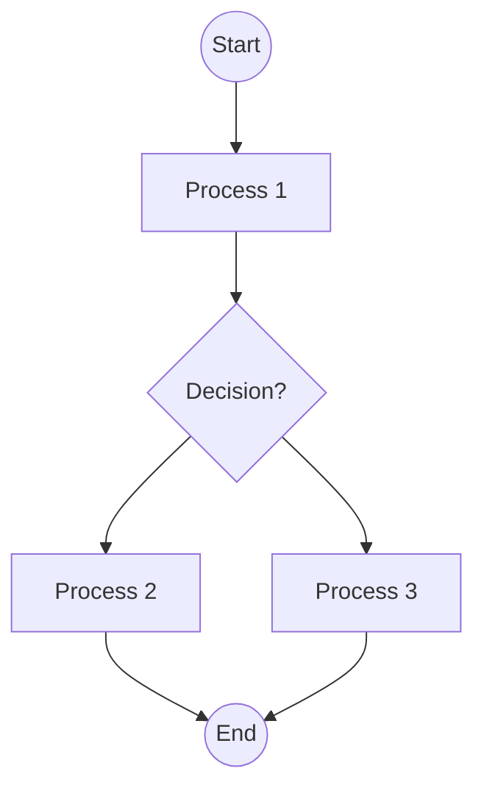

user

## Analyze the flowchart image and convert it to Mermaid syntax.

Follow these requirements strictly:

1. Use proper Mermaid flowchart syntax starting with 'flowchart TD' (top-down) or 'flowchart LR' (left-right)
2. Identify all nodes/boxes and give them appropriate IDs (A, B, C, etc.)
3. Include all decision diamonds with proper syntax using {condition?}
4. Add all connecting arrows and labels using ONLY '-->' (not '-- >' or other variations)
5. Use appropriate node shapes:
   - [Text] for process boxes
   - {Text} for decision diamonds  
   - ((Text)) for start/end circles
   - [Text] for regular rectangles
6. Include all text labels exactly as shown in the image
7. Ensure proper flow direction and connections

IMPORTANT MERMAID SYNTAX RULES:
- Always use '-->' for arrows (never '-- >')
- Node IDs must be followed immediately by node content: A[Process] or B{Decision?}
- Decision nodes use curly braces: {Is condition met?}
- Start/End nodes use double parentheses: ((Start)) or ((End))
- Process nodes use square brackets: [Do something]
- No spaces in arrow syntax: A --> B (not A -- > B)

EXAMPLE:


Provide only the Mermaid code without any additional explanation.assistant

```mermaid
flowchart TD
    A((Start)) --> B[Use safety precautions with cordless rotary tool]
    B --> C{Is video version needed?}
    C --> D[Provide video link]
    D --> E{No}
    E --> F[Mark cutting line on bottle]
    F --> G[Attach suction vise to sini]
    G --> H[Begin cutting with rotary tool and water]
    H --> I{Protect area from water}
    I --> J[Cover area with plastic]
    J --> K[Cut one side of the bottle]
    K --> L[Cut bottom of the bottle]
    L --> M[Cut other side of the bottle]
    M --> N{Is cut perfect?}
    N --> O[Prepare sanding mixture]
    O --> P{Sand cut edges of bottle}
    P --> Q{Smoothly cut glass bottle ready}
    Q --> R[Use cut bottle as dish or planter]
    R --> S[End]
    S --> T{No}
    T --> U[Use cut bottle as dish or planter]
    U --> V[End]
    V --> W{Yes}
    W --> X[Cover area with plastic]
    X --> Y[Cut one side of the bottle]
    Y --> Z[Cut bottom of the bottle]
    Z --> AA[Cut other side of the bottle]
    AA --> BB{Is cut perfect?}
    BB --> CC[Prepare sanding mixture]
    CC --> DD{Sand cut edges of bottle}
    DD --> EE{Smoothly cut glass bottle ready}
    EE --> FF[Use cut bottle as dish or planter]
    FF --> GG[End]
    GG --> HH{No}
    HH --> II[Use cut bottle as dish or planter]
    II --> JJ[End]
    JJ --> KK{Yes}
    KK --> LL[Cover area with plastic]
    LL --> MM[Cut one side of the bottle]
    MM --> NN[Cut bottom of the bottle]
    NN --> OO[Cut other side of the bottle]
    OO --> PP{Is cut perfect?}
    PP --> QQ[Prepare sanding mixture]
    QQ --> RR{Sand cut edges of bottle}
    RR --> SS{Smoothly cut glass bottle ready}
    SS --> TT[Use cut bottle as dish or planter]
    TT --> UU[End]
    UU --> VV{No}
    VV --> WW[Use cut bottle as dish or planter]
    WW --> XX[End]
    XX --> YY{Yes}
    YY --> ZZ[Cover area with plastic]
    ZZ --> AAA[Cut one side of the bottle]
    AAA --> BBB[Cut bottom of the bottle]
    BBB --> CCC[Cut other side of the bottle]
    CCC --> DDD{Is cut perfect?}
    DDD --> EEE[Prepare sand