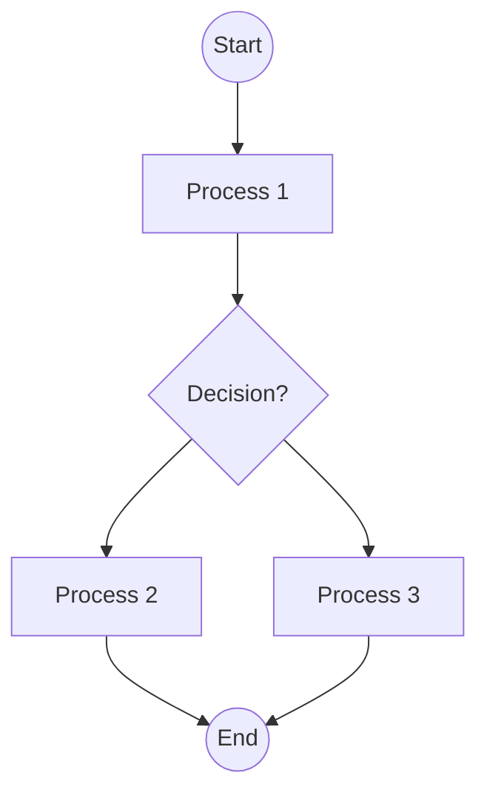

user

## Analyze the flowchart image and convert it to Mermaid syntax.

Follow these requirements strictly:

1. Use proper Mermaid flowchart syntax starting with 'flowchart TD' (top-down) or 'flowchart LR' (left-right)
2. Identify all nodes/boxes and give them appropriate IDs (A, B, C, etc.)
3. Include all decision diamonds with proper syntax using {condition?}
4. Add all connecting arrows and labels using ONLY '-->' (not '-- >' or other variations)
5. Use appropriate node shapes:
   - [Text] for process boxes
   - {Text} for decision diamonds  
   - ((Text)) for start/end circles
   - [Text] for regular rectangles
6. Include all text labels exactly as shown in the image
7. Ensure proper flow direction and connections

IMPORTANT MERMAID SYNTAX RULES:
- Always use '-->' for arrows (never '-- >')
- Node IDs must be followed immediately by node content: A[Process] or B{Decision?}
- Decision nodes use curly braces: {Is condition met?}
- Start/End nodes use double parentheses: ((Start)) or ((End))
- Process nodes use square brackets: [Do something]
- No spaces in arrow syntax: A --> B (not A -- > B)

EXAMPLE:


Provide only the Mermaid code without any additional explanation.assistant

```mermaid
flowchart TD
    A((Start)) --> B[Read through prior forum posts]
    B --> C[Contextual understanding of the conflict]
    C --> D[Identify key individuals involved]
    D --> E{Identification of participant}
    E --> F[Does initiator belong to most represented religion?]
    F --> G[Background understanding of initiator's motivation]
    G --> H[Maintain a level-headed approach]
    H --> I[Do you share the same faith as the initiator?]
    I --> J[Engage with the person as a peer in faith]
    J --> K{Does initiator persist despite interventions?}
    K --> L[Discuss importance of respecting differences]
    L --> M[Report behavior to moderators]
    M --> N{Examples of inappropriate behavior}
    N --> O[Reporting of incident for review]
    O --> P[Attempt to persuade]
    P --> Q[Message to participants]
    Q --> R[Do you share the same faith as the initiator?]
    R --> S[Background understanding of initiator's motivation]
    S --> T[Maintain a level-headed approach]
    T --> U[Do you share the same faith as the initiator?]
    U --> V[Engage with the person as a peer in faith]
    V --> W{Does initiator persist despite interventions?}
    W --> X[Discuss importance of respecting differences]
    X --> Y[Report behavior to moderators]
    Y --> Z{Examples of inappropriate behavior}
    Z --> AA[Reporting of incident for review]
    AA --> BB[Attempt to persuade]
    BB --> CC[Message to participants]
    CC --> DD[Do you share the same faith as the initiator?]
    DD --> EE[Background understanding of initiator's motivation]
    EE --> FF[Maintain a level-headed approach]
    FF --> GG[Do you share the same faith as the initiator?]
    GG --> HH[Engage with the person as a peer in faith]
    HH --> II{Does initiator persist despite interventions?}
    II --> JJ[Discuss importance of respecting differences]
    JJ --> KK[Report behavior to moderators]
    KK --> LL{Examples of inappropriate behavior}
    LL --> MM[Reporting of incident for review]
    MM --> NN[Attempt to persuade]
    NN --> OO[Message to participants]
    OO --> PP[Do you share the same faith as the initiator?]
    PP --> QQ[Background understanding of initiator's motivation]
    QQ --> RR[Maintain a level-headed approach]
    RR --> SS[Do you share the same faith as the initiator?]
    SS --> TT[Engage with the person as a peer in faith]
    TT --> UU{Does initiator persist despite interventions?}
    UU --> VV[Discuss importance of respecting differences]
    VV --> WW[Report behavior to moderators]
    WW --> XX{Examples of