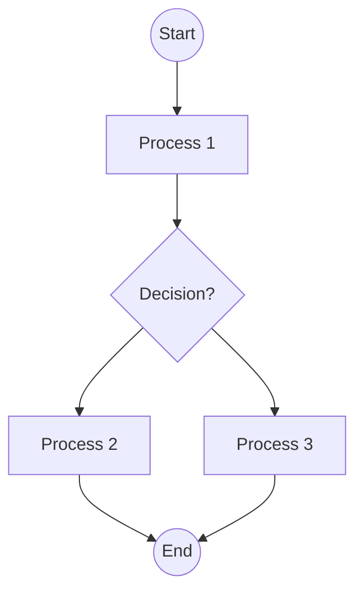

user

## Analyze the flowchart image and convert it to Mermaid syntax.

Follow these requirements strictly:

1. Use proper Mermaid flowchart syntax starting with 'flowchart TD' (top-down) or 'flowchart LR' (left-right)
2. Identify all nodes/boxes and give them appropriate IDs (A, B, C, etc.)
3. Include all decision diamonds with proper syntax using {condition?}
4. Add all connecting arrows and labels using ONLY '-->' (not '-- >' or other variations)
5. Use appropriate node shapes:
   - [Text] for process boxes
   - {Text} for decision diamonds  
   - ((Text)) for start/end circles
   - [Text] for regular rectangles
6. Include all text labels exactly as shown in the image
7. Ensure proper flow direction and connections

IMPORTANT MERMAID SYNTAX RULES:
- Always use '-->' for arrows (never '-- >')
- Node IDs must be followed immediately by node content: A[Process] or B{Decision?}
- Decision nodes use curly braces: {Is condition met?}
- Start/End nodes use double parentheses: ((Start)) or ((End))
- Process nodes use square brackets: [Do something]
- No spaces in arrow syntax: A --> B (not A -- > B)

EXAMPLE:


Provide only the Mermaid code without any additional explanation.assistant

```mermaid
flowchart TD
    A((Start)) --> B[Read n]
    B --> C{Set a to 3}
    C --> D[Set b to 0]
    D --> E[Set c to 2]
    E --> F{Is n equal to 0?}
    F --> G{Is n equal to 1?}
    G --> H[Is n equal to 2?]
    H --> I[Set sum to 5]
    I --> J{Is n greater than 2?}
    J --> K[Add d to sum]
    K --> L[Update a to b]
    L --> M[Update c to c]
    M --> N{Decrement n by 1}
    N --> O[Return sum]
    O --> P[End]
    P --> Q[Update b to c]
    Q --> R[Update c to c]
    R --> S[Decrement n by 1]
    S --> T[Return 5]
    T --> U[Return sum]
    U --> V[Is n equal to 0?]
    V --> W[Is n equal to 1?]
    W --> X[Is n equal to 2?]
    X --> Y[Set sum to 5]
    Y --> Z[Is n greater than 2?]
    Z --> AA[Add d to sum]
    AA --> BB[Update a to b]
    BB --> CC[Update c to c]
    CC --> DD[Decrement n by 1]
    DD --> EE[Return 3]
    EE --> FF[End]
    FF --> GG[Return 3]
    GG --> HH[End]
    HH --> II[Return 5]
    II --> JJ[Return sum]
    JJ --> KK[Is n equal to 0?]
    KK --> LL[Is n equal to 1?]
    LL --> MM[Is n equal to 2?]
    MM --> NN[Set sum to 5]
    NN --> OO[Is n greater than 2?]
    OO --> PP[Add d to sum]
    PP --> QQ[Update a to b]
    QQ --> RR[Update c to c]
    RR --> SS[Decrement n by 1]
    SS --> TT[Return 3]
    TT --> UU[End]
    UU --> VV[Return 5]
    VV --> WW[Return sum]
    WW --> XX[Is n equal to 0?]
    XX --> YY[Is n equal to 1?]
    YY --> ZZ[Is n equal to 2?]
    ZZ --> AAA[Set sum to 5]
    AAA --> BBB[Is n greater than 2?]
    BBB --> CCC[Add d to sum]
    CCC --> DDD[Update a to b