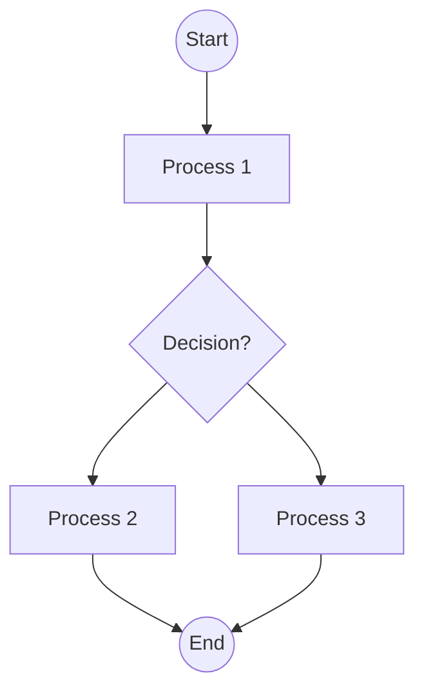

user

## Analyze the flowchart image and convert it to Mermaid syntax.

Follow these requirements strictly:

1. Use proper Mermaid flowchart syntax starting with 'flowchart TD' (top-down) or 'flowchart LR' (left-right)
2. Identify all nodes/boxes and give them appropriate IDs (A, B, C, etc.)
3. Include all decision diamonds with proper syntax using {condition?}
4. Add all connecting arrows and labels using ONLY '-->' (not '-- >' or other variations)
5. Use appropriate node shapes:
   - [Text] for process boxes
   - {Text} for decision diamonds  
   - ((Text)) for start/end circles
   - [Text] for regular rectangles
6. Include all text labels exactly as shown in the image
7. Ensure proper flow direction and connections

IMPORTANT MERMAID SYNTAX RULES:
- Always use '-->' for arrows (never '-- >')
- Node IDs must be followed immediately by node content: A[Process] or B{Decision?}
- Decision nodes use curly braces: {Is condition met?}
- Start/End nodes use double parentheses: ((Start)) or ((End))
- Process nodes use square brackets: [Do something]
- No spaces in arrow syntax: A --> B (not A -- > B)

EXAMPLE:


Provide only the Mermaid code without any additional explanation.assistant

```mermaid
flowchart TD
    A((Start)) --> B[Prepare Peach Candy Gummies]
    B --> C{For Each Gummy?}
    C --> D[Snip Triangle for Smile]
    C --> E{Prepare Frosting as Glue}
    E --> F[Attach Mini M&M's Eyes]
    F --> G{For Each Gummy?}
    G --> H[Apply Frosting]
    H --> I{Attach Candy Corn Tails}
    I --> J[Place Mini M&M]
    J --> K{For Each Gummy?}
    K --> L[Attach Candy Corn Tail]
    L --> M{Flat Side on Candy Corn?}
    M --> N[Completed Candy Gummy Fish]
    N --> O{Create Flat Side}
    O --> P{Apply Frosting to Candy Corn}
    P --> Q((End))
    Q --> R[Attach Candy Corn Tail]
    R --> S{For Each Gummy?}
    S --> T[Attach Candy Corn Tail]
    T --> U{For Each Gummy?}
    U --> V[Attach Candy Corn Tail]
    V --> W{For Each Gummy?}
    W --> X[Attach Candy Corn Tail]
    X --> Y{For Each Gummy?}
    Y --> Z[Attach Candy Corn Tail]
    Z --> ((End))
```