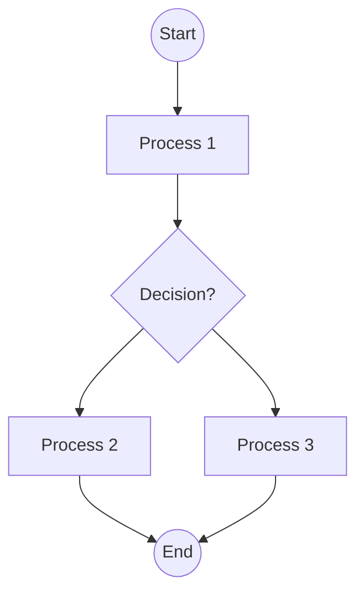

user

## Analyze the flowchart image and convert it to Mermaid syntax.

Follow these requirements strictly:

1. Use proper Mermaid flowchart syntax starting with 'flowchart TD' (top-down) or 'flowchart LR' (left-right)
2. Identify all nodes/boxes and give them appropriate IDs (A, B, C, etc.)
3. Include all decision diamonds with proper syntax using {condition?}
4. Add all connecting arrows and labels using ONLY '-->' (not '-- >' or other variations)
5. Use appropriate node shapes:
   - [Text] for process boxes
   - {Text} for decision diamonds  
   - ((Text)) for start/end circles
   - [Text] for regular rectangles
6. Include all text labels exactly as shown in the image
7. Ensure proper flow direction and connections

IMPORTANT MERMAID SYNTAX RULES:
- Always use '-->' for arrows (never '-- >')
- Node IDs must be followed immediately by node content: A[Process] or B{Decision?}
- Decision nodes use curly braces: {Is condition met?}
- Start/End nodes use double parentheses: ((Start)) or ((End))
- Process nodes use square brackets: [Do something]
- No spaces in arrow syntax: A --> B (not A -- > B)

EXAMPLE:


Provide only the Mermaid code without any additional explanation.assistant

```mermaid
flowchart TD
    A((Start)) --> B[Enter Item Menu / Press X button or Xbox 360 controller]
    B --> C[Access to Item Categories - Item menu with 7 categories shown]
    C --> D[Map pack shipped or Hermet]
    D --> E[End - Cannot edit lighting effects]
    E --> F[Select Lighting Effects Category - Navigate to category A]
    F --> G[Purchase Lighting Effects - Acquire lighting effects]
    G --> H[Lighting Effects Acquired - Six effects available]
    H --> I[Apply Lighting Effects - Combine effects for darkness]
    I --> J{Fx, Goomy selected?}
    J --> K[Map Darkened]
    K --> L[Add Fx, Olde Tiney and Fx, Juicy]
    L --> M[Map Substantially Darkened]
    M --> N[Desired orange colour from Fx, Juicy]
    N --> O[End - Keep Fx, Juicy for radiation-like effect]
    O --> P[Remove Fx, Juicy]
    P --> Q[End - Sepia tone from Fx, Olde Tiney stands out]
    Q --> R[End - Achieve maximum darkness by removing light pieces]
    R --> S[Remove light pieces completely?]
    S --> T{Energy does or fusion cells present?}
    T --> U[End - No light pieces to consider for removal]
    U --> V[End - Retain some light pieces for aesthetic purposes]
    V --> W[End - Achieve maximum darkness by removing light pieces]
    W --> X[End - Retain some light pieces for aesthetic purposes]
    X --> Y[End - Achieve maximum darkness by removing light pieces]
    Y --> Z[End - Retain some light pieces for aesthetic purposes]
    Z --> ((End))
    ((End)) --> ((Start))
```