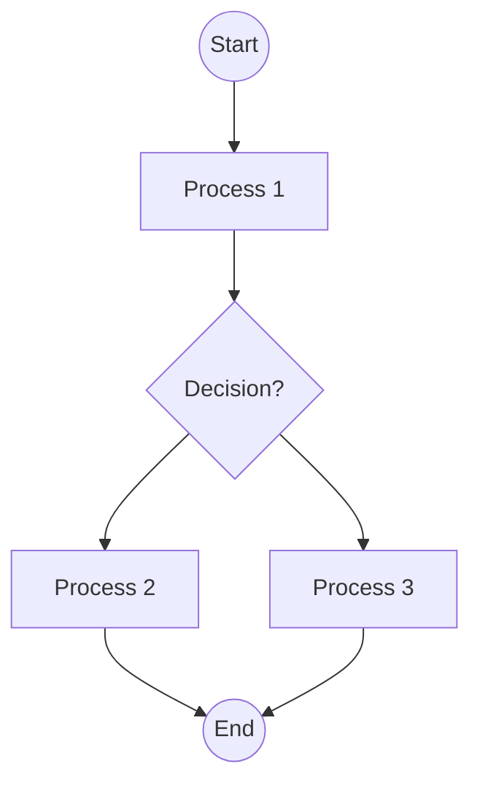

user

## Analyze the flowchart image and convert it to Mermaid syntax.

Follow these requirements strictly:

1. Use proper Mermaid flowchart syntax starting with 'flowchart TD' (top-down) or 'flowchart LR' (left-right)
2. Identify all nodes/boxes and give them appropriate IDs (A, B, C, etc.)
3. Include all decision diamonds with proper syntax using {condition?}
4. Add all connecting arrows and labels using ONLY '-->' (not '-- >' or other variations)
5. Use appropriate node shapes:
   - [Text] for process boxes
   - {Text} for decision diamonds  
   - ((Text)) for start/end circles
   - [Text] for regular rectangles
6. Include all text labels exactly as shown in the image
7. Ensure proper flow direction and connections

IMPORTANT MERMAID SYNTAX RULES:
- Always use '-->' for arrows (never '-- >')
- Node IDs must be followed immediately by node content: A[Process] or B{Decision?}
- Decision nodes use curly braces: {Is condition met?}
- Start/End nodes use double parentheses: ((Start)) or ((End))
- Process nodes use square brackets: [Do something]
- No spaces in arrow syntax: A --> B (not A -- > B)

EXAMPLE:


Provide only the Mermaid code without any additional explanation.assistant

```mermaid
flowchart TD
    A((Start)) --> B[1 Piece of 8.5 by 11 inch Paper]
    B --> C[Type]
    C --> D[Pencil]
    D --> E[Ruler]
    E --> F[Scissors (Optional)]
    F --> G[Fold paper in half length-wise]
    G --> H[Pull the paper down to create a crease]
    H --> I[Repeat on other side]
    I --> J[Pull the overhanging paper back]
    J --> K[Fold the edges down over center crease]
    K --> L[Fold the triangular tip of the nose back]
    L --> M[Fold the wings into the center and crease]
    M --> N[Pull the nose to the trailing edge on airplane side]
    N --> O[Measure back 1 inch from crease and mark]
    O --> P[Pull the nose forward to the 1 inch mark and crease]
    P --> Q[Unfold the new crease, pull leading edges inward]
    Q --> R[Refold the nose over adjusted leading edges]
    R --> S[Fold the fuselage in half along center crease]
    S --> T[Fold down the canards]
    T --> U[Canards aligned with zero degree angle?]
    U --> V[Adjust canards to zero degree angle]
    V --> W[Conduct test flights to determine trim requirements]
    W --> X[Airplane requires trim adjustments?]
    X --> Y[Apply necessary trim adjustments]
    Y --> Z[Airplane ready for regular flights]
    Z --> AA[Want to add additional surfaces?]
    AA --> BB[Use scissors to cut and fold additional surfaces]
    BB --> CC[Fold down the wings at fourth folds]
    CC --> DD[Trailing edges of wings aligned with fuselage?]
    DD --> EE[Adjust wings to align trailing edges]
    EE --> FF[Fold the wings down to the fourth folds]
    FF --> GG[Apply tape to the nose above and below canard]
    GG --> HH[Tape the LEFs wing joint]
    HH --> II[Apply tape to rear of fuselage and over wing root]
    II --> JJ[Secure canard folds to fuselage with tape]
    JJ --> KK[Enjoy flying the airplane]
    KK --> LL[Super Stratovulkan paper airplane complete]
    LL --> MM[End]
```