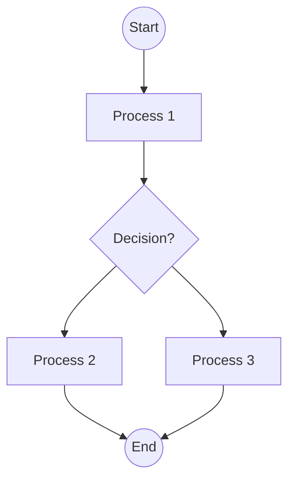

user

## Analyze the flowchart image and convert it to Mermaid syntax.

Follow these requirements strictly:

1. Use proper Mermaid flowchart syntax starting with 'flowchart TD' (top-down) or 'flowchart LR' (left-right)
2. Identify all nodes/boxes and give them appropriate IDs (A, B, C, etc.)
3. Include all decision diamonds with proper syntax using {condition?}
4. Add all connecting arrows and labels using ONLY '-->' (not '-- >' or other variations)
5. Use appropriate node shapes:
   - [Text] for process boxes
   - {Text} for decision diamonds  
   - ((Text)) for start/end circles
   - [Text] for regular rectangles
6. Include all text labels exactly as shown in the image
7. Ensure proper flow direction and connections

IMPORTANT MERMAID SYNTAX RULES:
- Always use '-->' for arrows (never '-- >')
- Node IDs must be followed immediately by node content: A[Process] or B{Decision?}
- Decision nodes use curly braces: {Is condition met?}
- Start/End nodes use double parentheses: ((Start)) or ((End))
- Process nodes use square brackets: [Do something]
- No spaces in arrow syntax: A --> B (not A -- > B)

EXAMPLE:


Provide only the Mermaid code without any additional explanation.assistant

```mermaid
flowchart TD
    A((Start)) --> B{Dog showing signs of ear discomfort?}
    B --> C[Identify Discomfort]
    C --> D[Observation of behavior]
    D --> E{Foreign body visible?}
    E --> F[Take dog to vet]
    F --> G{Vet's assessment}
    G --> H[Examination with Otoscope]
    H --> I{Otoscope examination}
    I --> J{Deep visual inspection results}
    J --> K{Foreign body found with otoscope?}
    K --> L[Removal of Foreign Body]
    L --> M{Use of alligator forceps}
    M --> N{Foreign body removed from ear}
    N --> O{Foreign body successfully removed?}
    O --> P[Foreign body removed without pain]
    P --> Q{Repeat removal or consider alternatives}
    Q --> R{Further examination or alternative treatment}
    R --> S((End))
    I --> T[Remove visible foreign body]
    T --> U{Foreign body successfully removed?}
    U --> V[Foreign body removed without pain]
    V --> W{Repeat removal or consider alternatives}
    W --> X{Further examination or alternative treatment}
    X --> S
    K --> Y{Foreign body removed from ear}
    Y --> Z{Foreign body successfully removed?}
    Z --> AA[Foreign body removed without pain]
    AA --> BB{Repeat removal or consider alternatives}
    BB --> CC{Further examination or alternative treatment}
    CC --> S
    L --> DD{Foreign body removed from ear}
    DD --> EE{Foreign body successfully removed?}
    EE --> FF[Foreign body removed without pain]
    FF --> GG{Repeat removal or consider alternatives}
    GG --> HH{Further examination or alternative treatment}
    HH --> S
    M --> II{Foreign body removed from ear}
    II --> JJ{Foreign body successfully removed?}
    JJ --> KK[Foreign body removed without pain]
    KK --> LL{Repeat removal or consider alternatives}
    LL --> MM{Further examination or alternative treatment}
    MM --> S
    N --> NN{Foreign body removed from ear}
    NN --> OO{Foreign body successfully removed?}
    OO --> PP[Foreign body removed without pain]
    PP --> QQ{Repeat removal or consider alternatives}
    QQ --> RR{Further examination or alternative treatment}
    RR --> S
    O --> SS{Foreign body removed from ear}
    SS --> TT{Foreign body successfully removed?}
    TT --> UU[Foreign body removed without pain]
    UU --> VV{Repeat removal or consider alternatives}
    VV --> WW{Further examination or alternative treatment}
    WW --> S
    P --> XX{Foreign body removed from ear}
    XX --> YY{Foreign body successfully removed?}
    YY --> ZZ[Foreign body removed without pain]
   