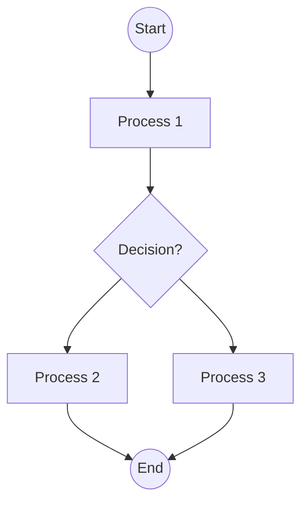

user

## Analyze the flowchart image and convert it to Mermaid syntax.

Follow these requirements strictly:

1. Use proper Mermaid flowchart syntax starting with 'flowchart TD' (top-down) or 'flowchart LR' (left-right)
2. Identify all nodes/boxes and give them appropriate IDs (A, B, C, etc.)
3. Include all decision diamonds with proper syntax using {condition?}
4. Add all connecting arrows and labels using ONLY '-->' (not '-- >' or other variations)
5. Use appropriate node shapes:
   - [Text] for process boxes
   - {Text} for decision diamonds  
   - ((Text)) for start/end circles
   - [Text] for regular rectangles
6. Include all text labels exactly as shown in the image
7. Ensure proper flow direction and connections

IMPORTANT MERMAID SYNTAX RULES:
- Always use '-->' for arrows (never '-- >')
- Node IDs must be followed immediately by node content: A[Process] or B{Decision?}
- Decision nodes use curly braces: {Is condition met?}
- Start/End nodes use double parentheses: ((Start)) or ((End))
- Process nodes use square brackets: [Do something]
- No spaces in arrow syntax: A --> B (not A -- > B)

EXAMPLE:


Provide only the Mermaid code without any additional explanation.assistant

```mermaid
flowchart TD
    A((Start)) --> B[Accept sorted array 'A' and number 'x']
    B --> C[Initialize 'left' to 0 and 'right' to length of 'A' - 1]
    C --> D[Initialize'result' to -]
    D --> E{While 'left' <= 'right'?}
    E --> F[Calculate'mid' as (left + right) / 2]
    F --> G{Is 'X' == 'A[mid]'?}
    G --> H[Set'result' to'mid' + 1]
    H --> I[Set 'left' to'mid' + 1]
    I --> J{Is 'X' < 'A[mid]'?}
    J --> K[Set 'right' to'mid' - 1]
    K --> L[Set 'left' to'mid' + 1]
    L --> M[Output'result']
    M --> N((End))
    E --> N
    G --> N
    J --> N
    K --> N
    L --> N
    F --> N
    E --> E
    G --> G
    J --> J
    K --> K
    L --> L
    H --> H
    I --> I
    M --> M
```