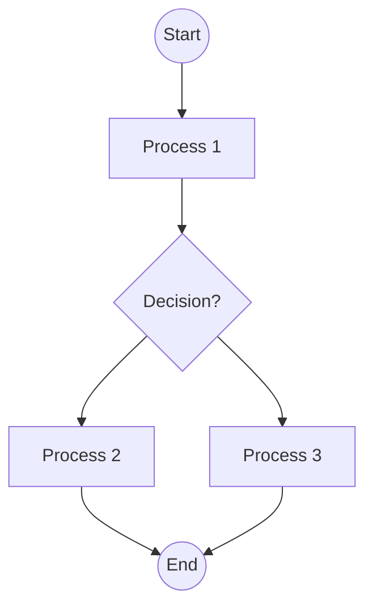

user

## Analyze the flowchart image and convert it to Mermaid syntax.

Follow these requirements strictly:

1. Use proper Mermaid flowchart syntax starting with 'flowchart TD' (top-down) or 'flowchart LR' (left-right)
2. Identify all nodes/boxes and give them appropriate IDs (A, B, C, etc.)
3. Include all decision diamonds with proper syntax using {condition?}
4. Add all connecting arrows and labels using ONLY '-->' (not '-- >' or other variations)
5. Use appropriate node shapes:
   - [Text] for process boxes
   - {Text} for decision diamonds  
   - ((Text)) for start/end circles
   - [Text] for regular rectangles
6. Include all text labels exactly as shown in the image
7. Ensure proper flow direction and connections

IMPORTANT MERMAID SYNTAX RULES:
- Always use '-->' for arrows (never '-- >')
- Node IDs must be followed immediately by node content: A[Process] or B{Decision?}
- Decision nodes use curly braces: {Is condition met?}
- Start/End nodes use double parentheses: ((Start)) or ((End))
- Process nodes use square brackets: [Do something]
- No spaces in arrow syntax: A --> B (not A -- > B)

EXAMPLE:


Provide only the Mermaid code without any additional explanation.assistant

```mermaid
flowchart TD
    A((Start: Ensure Child Safety in Shopping Cart)) --> B[Child placed in shopping cart.]
    B --> C{Parent/guardian stays with the child at all times.}
    C --> D[Parent needs to grab an item off a shelf?]
    D --> E[Move cart with child along to the item.]
    E --> F{Child remains within sight and under supervision.}
    F --> G[Parent/guardian must keep child in line of sight at all times.]
    G --> H{Parent needs to turn away from child?}
    H --> I[Reposition so the child remains in view while turning.]
    I --> J{Child stays visible to parent/guardian.}
    J --> K{Presence of an older child.}
    K --> L[Older child wants to push the cart with the younger child inside?]
    L --> M{Prohibit the older child from pushing the cart.}
    M --> N[Ensure an adult is always pushing the cart.]
    N --> O{Parent cannot leave child at home?}
    O --> P{Another adult accompanies during}
    P --> Q{Assign roles for child supervision and cart control.}
    Q --> R{One adult manages the cart, the other supervises the child.}
    R --> S{End: Child Safety in Shopping Cart Maintained}
    S --> J
    J --> K
    K --> L
    L --> M
    M --> N
    N --> O
    O --> P
    P --> Q
    Q --> R
    R --> S
    S --> ((End))
    ((End)) --> ((Start))
    ((Start)) --> B
    B --> C
    C --> D
    D --> E
    E --> F
    F --> G
    G --> H
    H --> I
    I --> J
    J --> K
    K --> L
    L --> M
    M --> N
    N --> O
    O --> P
    P --> Q
    Q --> R
    R --> S
    S --> ((End))
    ((End)) --> ((Start))
    ((Start)) --> B
    B --> C
    C --> D
    D --> E
    E --> F
    F --> G
    G --> H
    H --> I
    I --> J
    J --> K
    K --> L
    L --> M
    M --> N
    N --> O
    O --> P
    P --> Q
    Q --> R
    R --> S
    S --> ((End))
    ((End)) --> ((Start))
    ((Start)) --> B
    B --> C
    C --> D
    D --> E
    E --> F
    F