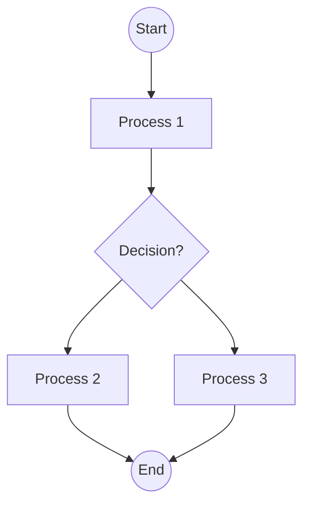

user

## Analyze the flowchart image and convert it to Mermaid syntax.

Follow these requirements strictly:

1. Use proper Mermaid flowchart syntax starting with 'flowchart TD' (top-down) or 'flowchart LR' (left-right)
2. Identify all nodes/boxes and give them appropriate IDs (A, B, C, etc.)
3. Include all decision diamonds with proper syntax using {condition?}
4. Add all connecting arrows and labels using ONLY '-->' (not '-- >' or other variations)
5. Use appropriate node shapes:
   - [Text] for process boxes
   - {Text} for decision diamonds  
   - ((Text)) for start/end circles
   - [Text] for regular rectangles
6. Include all text labels exactly as shown in the image
7. Ensure proper flow direction and connections

IMPORTANT MERMAID SYNTAX RULES:
- Always use '-->' for arrows (never '-- >')
- Node IDs must be followed immediately by node content: A[Process] or B{Decision?}
- Decision nodes use curly braces: {Is condition met?}
- Start/End nodes use double parentheses: ((Start)) or ((End))
- Process nodes use square brackets: [Do something]
- No spaces in arrow syntax: A --> B (not A -- > B)

EXAMPLE:


Provide only the Mermaid code without any additional explanation.assistant

```mermaid
flowchart TD
    A((Start)) --> B[Process 1]
    B --> C{Decision?}
    C --> D[Process 2]
    C --> E[Process 3]
    D --> F((End))
    E --> F
    F --> G[Process 4]
    G --> H{Decision?}
    H --> I[Process 5]
    H --> J[Process 6]
    I --> K[Process 7]
    J --> K
    K --> L[Process 8]
    L --> M[Process 9]
    M --> N{Decision?}
    N --> O[Process 10]
    N --> P[Process 11]
    O --> Q[Process 12]
    P --> Q
    Q --> R[Process 13]
    R --> S[Process 14]
    S --> T[Process 15]
    T --> U[Process 16]
    U --> V[Process 17]
    V --> W[Process 18]
    W --> X[Process 19]
    X --> Y[Process 20]
    Y --> Z[Process 21]
    Z --> ((End))
```