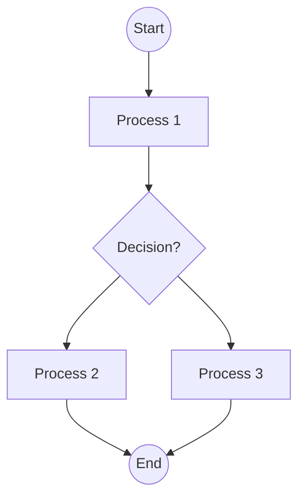

user

## Analyze the flowchart image and convert it to Mermaid syntax.

Follow these requirements strictly:

1. Use proper Mermaid flowchart syntax starting with 'flowchart TD' (top-down) or 'flowchart LR' (left-right)
2. Identify all nodes/boxes and give them appropriate IDs (A, B, C, etc.)
3. Include all decision diamonds with proper syntax using {condition?}
4. Add all connecting arrows and labels using ONLY '-->' (not '-- >' or other variations)
5. Use appropriate node shapes:
   - [Text] for process boxes
   - {Text} for decision diamonds  
   - ((Text)) for start/end circles
   - [Text] for regular rectangles
6. Include all text labels exactly as shown in the image
7. Ensure proper flow direction and connections

IMPORTANT MERMAID SYNTAX RULES:
- Always use '-->' for arrows (never '-- >')
- Node IDs must be followed immediately by node content: A[Process] or B{Decision?}
- Decision nodes use curly braces: {Is condition met?}
- Start/End nodes use double parentheses: ((Start)) or ((End))
- Process nodes use square brackets: [Do something]
- No spaces in arrow syntax: A --> B (not A -- > B)

EXAMPLE:


Provide only the Mermaid code without any additional explanation.assistant

```mermaid
flowchart TD
    A((Start)) --> B[Identify physical activit]
    B --> C[Start with a leisurely wal]
    C --> D{Ankle brace needed?}
    D --> E[Ankle brace needed?]
    E --> F{Wear brace}
    F --> G{Continue without brace}
    G --> H{Learning new sport?}
    H --> I{Play at lower intensit}
    I --> J{Monitor walking surfaces}
    J --> K{Is the surface rough?}
    K --> L{Exercise caution}
    L --> M{Continue walking normally}
    M --> N{Select sneakers for exercise}
    N --> O{High-top sneakers stabilize?}
    O --> P{Wear high-top sneakers}
    P --> Q{Choose other supportive footwear}
    Q --> R{Ensure shoes fit well}
    R --> S{Check soles for non-slick properties}
    S --> T{Are high heels a necessity?}
    T --> U{Postpone wearing high heels}
    U --> V{Consult a physical therapist}
    V --> W{Receive strengthening exercises}
    W --> X{Store exercises in routine}
    X --> Y{End}
    Y --> Z{High-top sneakers stabilize?}
    Z --> O
    O --> P
    P --> Q
    Q --> R
    R --> S
    S --> T
    T --> U
    U --> V
    V --> W
    W --> X
    X --> Y
    Y --> Z
    Z --> O
    O --> P
    P --> Q
    Q --> R
    R --> S
    S --> T
    T --> U
    U --> V
    V --> W
    W --> X
    X --> Y
    Y --> Z
    Z --> O
    O --> P
    P --> Q
    Q --> R
    R --> S
    S --> T
    T --> U
    U --> V
    V --> W
    W --> X
    X --> Y
    Y --> Z
    Z --> O
    O --> P
    P --> Q
    Q --> R
    R --> S
    S --> T
    T --> U
    U --> V
    V --> W
    W --> X
    X --> Y
    Y --> Z
    Z --> O
    O --> P
    P --> Q
    Q --> R
    R --> S
    S --> T
    T --> U
    U --> V
    V --> W
    W --> X
    X --> Y
    Y --> Z
    Z --> O
    O --> P
    P --> Q
    Q --> R
    R --> S
    S --> T
    T