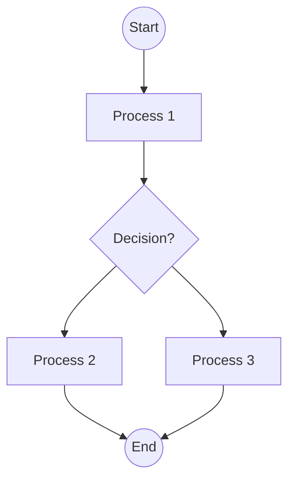

user

## Analyze the flowchart image and convert it to Mermaid syntax.

Follow these requirements strictly:

1. Use proper Mermaid flowchart syntax starting with 'flowchart TD' (top-down) or 'flowchart LR' (left-right)
2. Identify all nodes/boxes and give them appropriate IDs (A, B, C, etc.)
3. Include all decision diamonds with proper syntax using {condition?}
4. Add all connecting arrows and labels using ONLY '-->' (not '-- >' or other variations)
5. Use appropriate node shapes:
   - [Text] for process boxes
   - {Text} for decision diamonds  
   - ((Text)) for start/end circles
   - [Text] for regular rectangles
6. Include all text labels exactly as shown in the image
7. Ensure proper flow direction and connections

IMPORTANT MERMAID SYNTAX RULES:
- Always use '-->' for arrows (never '-- >')
- Node IDs must be followed immediately by node content: A[Process] or B{Decision?}
- Decision nodes use curly braces: {Is condition met?}
- Start/End nodes use double parentheses: ((Start)) or ((End))
- Process nodes use square brackets: [Do something]
- No spaces in arrow syntax: A --> B (not A -- > B)

EXAMPLE:


Provide only the Mermaid code without any additional explanation.assistant

```mermaid
flowchart TD
    A((Start: Begin coping with ego strategy)) --> B[Recognize Your Own Ego]
    B --> C[Self-awareness of one's own ego]
    C --> D[Reflect on ego's impact on others]
    D --> E[Store: Awareness of personal ego traits]
    E --> F[Understand the Ego in Others]
    F --> G[Observation of others' behavior]
    G --> H[Recognize unconscious ego needs in others]
    H --> I[Store: Insights on others' ego-driven actions]
    I --> J[Identify Ego Imposition Points]
    J --> K[Avoid imposing your ego]
    K --> L[Store: List of 'dangerous' ego waters]
    L --> M[Accept the Nature of Ego]
    M --> N[Conceptual understanding of ego]
    N --> O[Accept individual uniqueness]
    O --> P[Output: Enhanced tolerance for different egos]
    P --> Q[Is it a War of Eggs?]
    Q --> R[Yes]
    R --> S[End: Finish coping with ego strategy]
    S --> T[Stay Ahead of Ego Matters]
    T --> U[Anticipation of potential conflicts]
    U --> V[Avoid ego traps]
    V --> W[Output: Reduced ego conflicts]
    W --> X[Contemplate on Ego Dynamics]
    X --> Y[Questions about ego]
    Y --> Z[Output: Knowledge of catering to expectations]
    Z --> AA[Understand Egoistic Expectations]
    AA --> BB[Egoistic behavior in people]
    BB --> CC[Identify expectations of egoistic people]
    CC --> DD[Output: Better coping mechanisms]
    DD --> EE[Seek answers to ego exertion]
    EE --> FF[Output: Mitigated ego-driven defenses]
    FF --> GG[Out: Mitigated ego-driven defenses]
    GG --> HH[Can You Afford to Lose?]
    HH --> II[Yes]
    II --> JJ[Yield in the argument]
    JJ --> KK[No]
    KK --> LL[Output: Enhanced tolerance for different egos]
    LL --> MM[Accept the Nature of Ego]
    MM --> NN[Conceptual understanding of ego]
    NN --> OO[Accept individual uniqueness]
    OO --> PP[Output: Enhanced tolerance for different egos]
    PP --> QQ[Is it a War of Eggs?]
    QQ --> RR[Yes]
    RR --> SS[End: Finish coping with ego strategy]
    SS --> TT[Stay Ahead of Ego Matters]
    TT --> UU[Anticipation of potential conflicts]
    UU --> VV[Avoid ego traps]
    VV --> WW[Output: Reduced ego conflicts]
    WW --> XX[Contemplate on Ego Dynamics]
    XX --> YY[Questions about ego