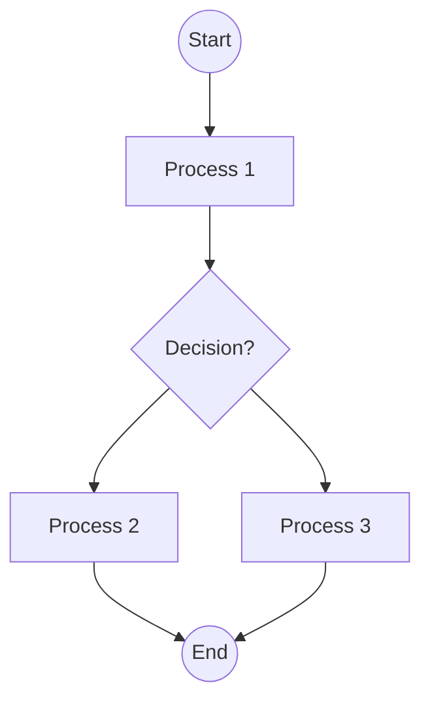

user

## Analyze the flowchart image and convert it to Mermaid syntax.

Follow these requirements strictly:

1. Use proper Mermaid flowchart syntax starting with 'flowchart TD' (top-down) or 'flowchart LR' (left-right)
2. Identify all nodes/boxes and give them appropriate IDs (A, B, C, etc.)
3. Include all decision diamonds with proper syntax using {condition?}
4. Add all connecting arrows and labels using ONLY '-->' (not '-- >' or other variations)
5. Use appropriate node shapes:
   - [Text] for process boxes
   - {Text} for decision diamonds  
   - ((Text)) for start/end circles
   - [Text] for regular rectangles
6. Include all text labels exactly as shown in the image
7. Ensure proper flow direction and connections

IMPORTANT MERMAID SYNTAX RULES:
- Always use '-->' for arrows (never '-- >')
- Node IDs must be followed immediately by node content: A[Process] or B{Decision?}
- Decision nodes use curly braces: {Is condition met?}
- Start/End nodes use double parentheses: ((Start)) or ((End))
- Process nodes use square brackets: [Do something]
- No spaces in arrow syntax: A --> B (not A -- > B)

EXAMPLE:


Provide only the Mermaid code without any additional explanation.assistant

```mermaid
flowchart TD
    A((Start Bicycle Trailer Construction)) --> B[Prepare Main Container]
    B --> C[Reinforce Plastic Bin with Wooden Beam]
    C --> D{Reinforced Container}
    D --> E[Install Rope Cleats]
    E --> F[Attach Rope Cleats to Wooden Beam]
    F --> G{Securable Points on Lid}
    G --> H[Construct the Chassis]
    H --> I{Are 8020 Aluminum Extrusions Available?}
    I --> J[Use 8020 Aluminum Extrusions]
    J --> K[Chassis Framework Completed]
    K --> L{Use Alternative Material?}
    L --> M[Prepare the Axles]
    M --> N{Are Hardened Steel Axles Available?}
    N --> O[Use Hardened Steel Axles]
    O --> P{Use Modified Bicycle Front Wheels}
    P --> Q[End Bicycle Trailer Construction]
    Q --> R[Strong Cantilevered Axles]
    R --> S[Attach Axles to Chassis]
    S --> T[Perform Friction Fit of Axle]
    T --> U[Build the Trailer Handle]
    U --> V[Create S-bend Handle and Reinforce]
    V --> W[Trailer Handle with Height Adjustment]
    W --> X[Prepare the Bicycle Attachment]
    X --> Y{Is Old Rubber Tubing Available?}
    Y --> Z[Use Rubber Tubing for Connection]
    Z --> AA[Use Bicycle Inner Tube Lashing]
    AA --> BB[Flexible Trailer Attachment Mechanism]
    BB --> CC[Attach the Trailer to the Bicycle]
    CC --> DD[Secure Trailer to Seatpost]
    DD --> EE[Bicycle Trailer Ready for Use]
    EE --> FF[End Bicycle Trailer Construction]
    FF --> GG[Attach Axles to Chassis]
    GG --> HH[Perform Friction Fit of Axle]
    HH --> II[Axles Securely Attached]
    II --> JJ[Build the Trailer Handle]
    JJ --> KK[Create S-bend Handle and Reinforce]
    KK --> LL[Trailer Handle with Height Adjustment]
    LL --> MM[Prepare the Bicycle Attachment]
    MM --> NN{Is Old Rubber Tubing Available?}
    NN --> OO[Use Rubber Tubing for Connection]
    OO --> PP[Use Bicycle Inner Tube Lashing]
    PP --> QQ[Flexible Trailer Attachment Mechanism]
    QQ --> RR[Attach the Trailer to the Bicycle]
    RR --> SS[Secure Trailer to Seatpost]
    SS --> TT[Bicycle Trailer Ready for Use]
    TT --> UU[End Bicycle Trailer Construction]
    UU --> VV[Attach Axles to Chassis]
    VV --> WW[Perform Friction Fit of Axle]
    WW --> XX[Axles Securely Attached]
    XX --> YY[Build the Trailer Handle]
    YY --> ZZ