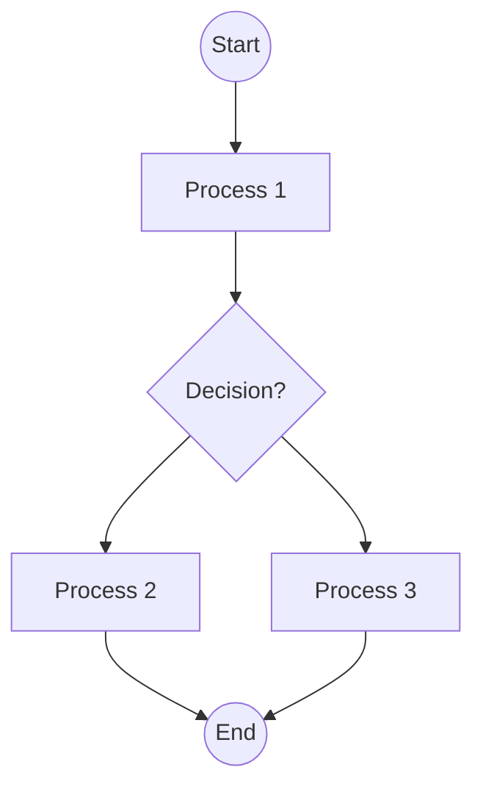

user

## Analyze the flowchart image and convert it to Mermaid syntax.

Follow these requirements strictly:

1. Use proper Mermaid flowchart syntax starting with 'flowchart TD' (top-down) or 'flowchart LR' (left-right)
2. Identify all nodes/boxes and give them appropriate IDs (A, B, C, etc.)
3. Include all decision diamonds with proper syntax using {condition?}
4. Add all connecting arrows and labels using ONLY '-->' (not '-- >' or other variations)
5. Use appropriate node shapes:
   - [Text] for process boxes
   - {Text} for decision diamonds  
   - ((Text)) for start/end circles
   - [Text] for regular rectangles
6. Include all text labels exactly as shown in the image
7. Ensure proper flow direction and connections

IMPORTANT MERMAID SYNTAX RULES:
- Always use '-->' for arrows (never '-- >')
- Node IDs must be followed immediately by node content: A[Process] or B{Decision?}
- Decision nodes use curly braces: {Is condition met?}
- Start/End nodes use double parentheses: ((Start)) or ((End))
- Process nodes use square brackets: [Do something]
- No spaces in arrow syntax: A --> B (not A -- > B)

EXAMPLE:


Provide only the Mermaid code without any additional explanation.assistant

```mermaid
flowchart TD
    Start((Start)) --> A[Cut open the echo mic]
    A --> B[Detach spring from mic]
    B --> C[Detached spring]
    C --> D{Decide if amp is from a device like Marshall MS-2}
    D --> E{Remove amp and resolder battery compartment}
    E --> F{Assemble own amp}
    F --> G[Test amp]
    G --> H[Working amp]
    H --> I[Glue clips to speaker and mic]
    I --> J[Solder piezo to jack output]
    J --> K[Spring connected to speaker and piezo]
    K --> L[Test spring reach in box]
    L --> M[Glue speaker and piezo in box]
    M --> N[Sound test completed]
    N --> O[Drill holes for component]
    O --> P[Glue amp in box]
    P --> Q[Extend wires for battery compartment]
    Q --> R[Attach knobs for pots (optional)]
    R --> S[Completed homemade spring reverb]
    S --> T[Quick test of setup]
    T --> U[Assembled reverb components in box]
    U --> V[Connect spring to hooks]
    V --> W[Hook up sound source to amp]
    W --> X[Ensure spring vibrates freely]
    X --> Y[Connect to audio interface]
    Y --> Z[Conduct sound tests]
    Z --> End((End))
```