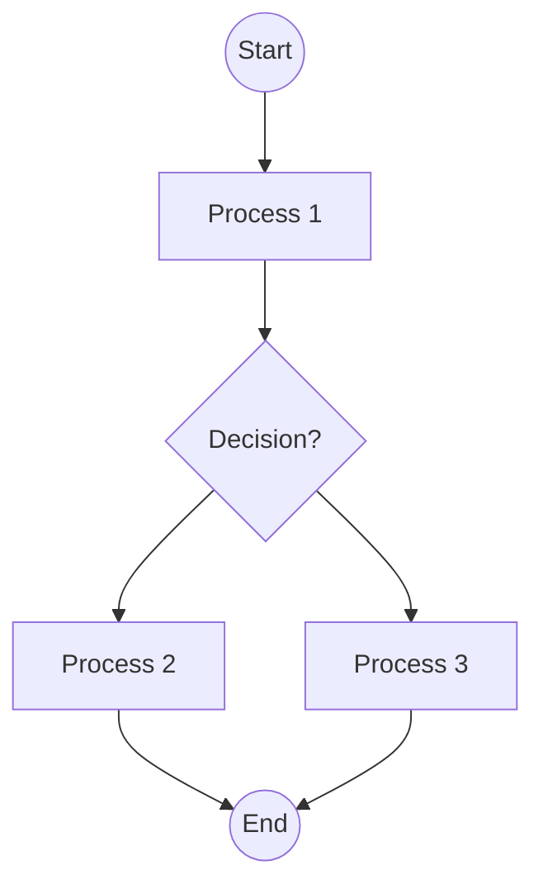

user

## Analyze the flowchart image and convert it to Mermaid syntax.

Follow these requirements strictly:

1. Use proper Mermaid flowchart syntax starting with 'flowchart TD' (top-down) or 'flowchart LR' (left-right)
2. Identify all nodes/boxes and give them appropriate IDs (A, B, C, etc.)
3. Include all decision diamonds with proper syntax using {condition?}
4. Add all connecting arrows and labels using ONLY '-->' (not '-- >' or other variations)
5. Use appropriate node shapes:
   - [Text] for process boxes
   - {Text} for decision diamonds  
   - ((Text)) for start/end circles
   - [Text] for regular rectangles
6. Include all text labels exactly as shown in the image
7. Ensure proper flow direction and connections

IMPORTANT MERMAID SYNTAX RULES:
- Always use '-->' for arrows (never '-- >')
- Node IDs must be followed immediately by node content: A[Process] or B{Decision?}
- Decision nodes use curly braces: {Is condition met?}
- Start/End nodes use double parentheses: ((Start)) or ((End))
- Process nodes use square brackets: [Do something]
- No spaces in arrow syntax: A --> B (not A -- > B)

EXAMPLE:


Provide only the Mermaid code without any additional explanation.assistant

```mermaid
flowchart TD
    A((Start)) --> B[Receive list1 as the first sequence]
    B --> C{Receive list2 as the second sequence}
    C --> D[Set c to 0 for counting elements in list1]
    D --> E{Set d to 0 for counting elements in list2}
    E --> F{For each element i in list1: Increment c by 1}
    F --> G{For each element i in list2: Increment d by 1}
    G --> H[For i in range 0 to c]
    H --> I{For j in range 0 to c}
    I --> J{Check if list1[i] equals list2[j]}
    J --> K{Return 1 (True, indicating an overlap)}
    K --> L{Return 0 (False, no overlap)}
    L --> M((End))
    M --> N{For each j}
    N --> O{No}
    O --> P{No more i}
    P --> Q{For each i}
    Q --> R{No more j}
    R --> S{For each i}
    S --> T{No}
    T --> U{No more i}
    U --> V{For each i}
    V --> W{No more j}
    W --> X{For each i}
    X --> Y{No}
    Y --> Z{No more i}
    Z --> ((End))
```