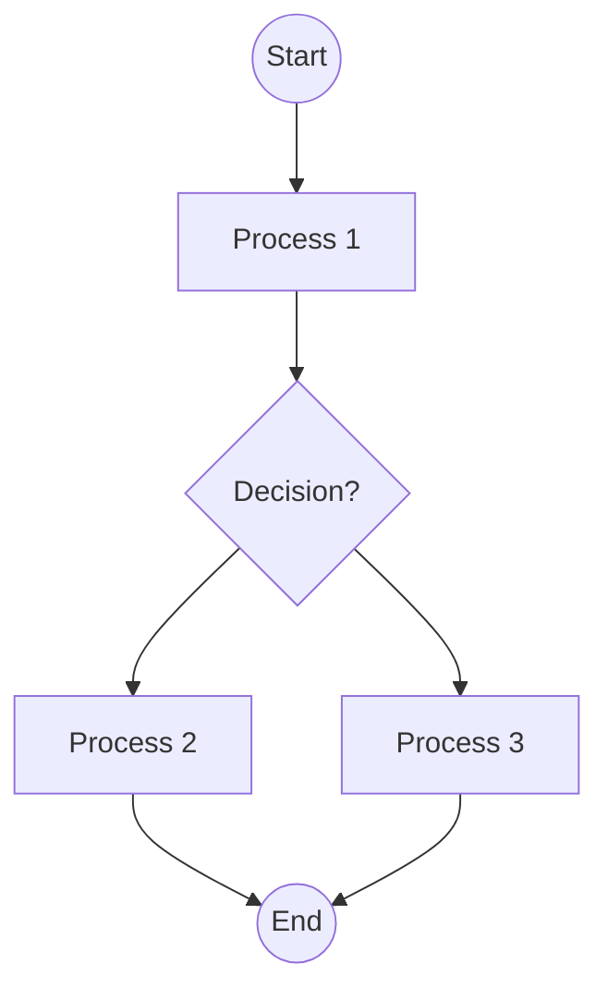

user

## Analyze the flowchart image and convert it to Mermaid syntax.

Follow these requirements strictly:

1. Use proper Mermaid flowchart syntax starting with 'flowchart TD' (top-down) or 'flowchart LR' (left-right)
2. Identify all nodes/boxes and give them appropriate IDs (A, B, C, etc.)
3. Include all decision diamonds with proper syntax using {condition?}
4. Add all connecting arrows and labels using ONLY '-->' (not '-- >' or other variations)
5. Use appropriate node shapes:
   - [Text] for process boxes
   - {Text} for decision diamonds  
   - ((Text)) for start/end circles
   - [Text] for regular rectangles
6. Include all text labels exactly as shown in the image
7. Ensure proper flow direction and connections

IMPORTANT MERMAID SYNTAX RULES:
- Always use '-->' for arrows (never '-- >')
- Node IDs must be followed immediately by node content: A[Process] or B{Decision?}
- Decision nodes use curly braces: {Is condition met?}
- Start/End nodes use double parentheses: ((Start)) or ((End))
- Process nodes use square brackets: [Do something]
- No spaces in arrow syntax: A --> B (not A -- > B)

EXAMPLE:


Provide only the Mermaid code without any additional explanation.assistant

```mermaid
flowchart TD
    A((Start: Identify Need for SSN or ITIN)) --> B[Process 1: Determine if Individual has an SSN]
    B --> C{Does the Individual have an SSN?}
    C --> D[Process 2: Locate SSN on W-2 Form or Other Documents]
    D --> E{Is the W-2 Form Available?}
    E --> F[Process 3: Output the SSN from the W-2 form]
    E --> G{Request W-2 Form from Employer}
    G --> H{Is the W-2 Form Obtainable from Employer?}
    H --> I[Process 4: Apply for a New Social Security Card]
    H --> J{Did the Individual Apply for a New Social Security Card?}
    J --> K[Process 5: Use Tax Forms for SSN]
    K --> L{Does the Individual Have Old Tax Forms?}
    L --> M[Process 6: Output the new Social Security Card with the SSN]
    M --> N{Determine if Individual has an ITIN}
    N --> O[Process 7: Output the valid ITIN]
    O --> P{Does the Individual have an ITIN?}
    P --> Q{Check Validity of ITIN}
    Q --> R{Is the ITIN Valid?}
    R --> S[Process 8: Apply for a New ITIN]
    R --> T{Did the Individual Apply for a New ITIN?}
    T --> U[Process 9: Output the new ITIN after approximately 2 weeks]
    U --> V{Call for Assistance}
    V --> ((End: Completion of SSN or ITIN Retrieval))
```