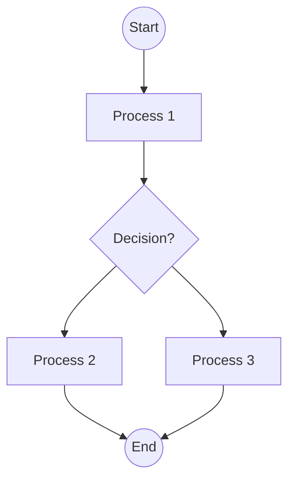

user

## Analyze the flowchart image and convert it to Mermaid syntax.

Follow these requirements strictly:

1. Use proper Mermaid flowchart syntax starting with 'flowchart TD' (top-down) or 'flowchart LR' (left-right)
2. Identify all nodes/boxes and give them appropriate IDs (A, B, C, etc.)
3. Include all decision diamonds with proper syntax using {condition?}
4. Add all connecting arrows and labels using ONLY '-->' (not '-- >' or other variations)
5. Use appropriate node shapes:
   - [Text] for process boxes
   - {Text} for decision diamonds  
   - ((Text)) for start/end circles
   - [Text] for regular rectangles
6. Include all text labels exactly as shown in the image
7. Ensure proper flow direction and connections

IMPORTANT MERMAID SYNTAX RULES:
- Always use '-->' for arrows (never '-- >')
- Node IDs must be followed immediately by node content: A[Process] or B{Decision?}
- Decision nodes use curly braces: {Is condition met?}
- Start/End nodes use double parentheses: ((Start)) or ((End))
- Process nodes use square brackets: [Do something]
- No spaces in arrow syntax: A --> B (not A -- > B)

EXAMPLE:


Provide only the Mermaid code without any additional explanation.assistant

```mermaid
flowchart TD
    A((Start)) --> B[Prepare for the Special Christmas Dining Event]
    B --> C[Decide on Festive Attire]
    C --> D[Cabin Door Decoration]
    D --> E{Pack own Christmas tree and decorations?}
    E --> F[Leave decorating to cruise ship]
    E --> G{Consider other decorations}
    G --> H[Gift Exchange Considerations]
    H --> I{If exchanging on cruise, pack suitable gifts}
    I --> J[Pack own bottle of champagne or wine]
    J --> K{Bring own champagne or wine?}
    K --> L[Pack own bottle of champagne or wine]
    L --> M((End))
    M --> N{Pack own bottle of champagne or wine}
    N --> O[Pack own bottle of champagne or wine]
    O --> P[Pack own bottle of champagne or wine]
    P --> Q[Pack own bottle of champagne or wine]
    Q --> R[Pack own bottle of champagne or wine]
    R --> S[Pack own bottle of champagne or wine]
    S --> T[Pack own bottle of champagne or wine]
    T --> U[Pack own bottle of champagne or wine]
    U --> V[Pack own bottle of champagne or wine]
    V --> W[Pack own bottle of champagne or wine]
    W --> X[Pack own bottle of champagne or wine]
    X --> Y[Pack own bottle of champagne or wine]
    Y --> Z[Pack own bottle of champagne or wine]
    Z --> ((End))
```