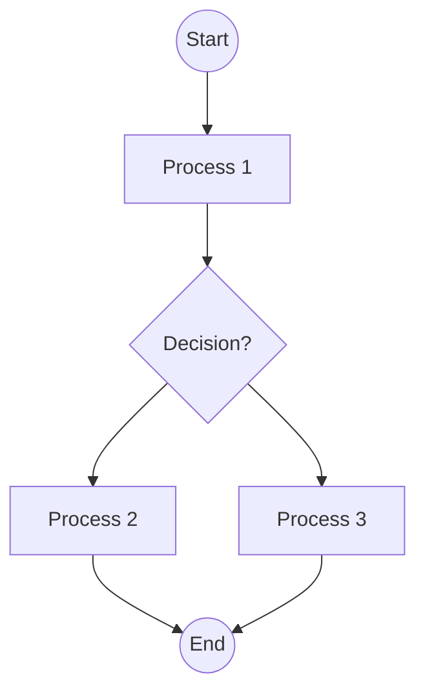

user

## Analyze the flowchart image and convert it to Mermaid syntax.

Follow these requirements strictly:

1. Use proper Mermaid flowchart syntax starting with 'flowchart TD' (top-down) or 'flowchart LR' (left-right)
2. Identify all nodes/boxes and give them appropriate IDs (A, B, C, etc.)
3. Include all decision diamonds with proper syntax using {condition?}
4. Add all connecting arrows and labels using ONLY '-->' (not '-- >' or other variations)
5. Use appropriate node shapes:
   - [Text] for process boxes
   - {Text} for decision diamonds  
   - ((Text)) for start/end circles
   - [Text] for regular rectangles
6. Include all text labels exactly as shown in the image
7. Ensure proper flow direction and connections

IMPORTANT MERMAID SYNTAX RULES:
- Always use '-->' for arrows (never '-- >')
- Node IDs must be followed immediately by node content: A[Process] or B{Decision?}
- Decision nodes use curly braces: {Is condition met?}
- Start/End nodes use double parentheses: ((Start)) or ((End))
- Process nodes use square brackets: [Do something]
- No spaces in arrow syntax: A --> B (not A -- > B)

EXAMPLE:


Provide only the Mermaid code without any additional explanation.assistant

```mermaid
flowchart TD
    A((Start)) --> B[Obtain Music]
    B --> C[Study Music]
    C --> D{Better Understanding of Music}
    D --> E[Identify Phrases in Music]
    E --> F{Learn from End}
    F --> G[Read Off the Music]
    G --> H{Learn Music from End}
    H --> I[Divide Music into Chunks]
    I --> J{First Chunk Memorized?}
    J --> K[Memorize Next Chunk with Eyes Open]
    K --> L{Move to Next Chunk}
    L --> M{Correct Mistakes}
    M --> N{Alternate Eyes Closed and Eyes Open}
    N --> O((End))
    O --> P[Play from Beginning to Memorized Point]
    P --> Q{Secure Memory of Piece}
    Q --> R[Check and Correct Wrong Notes]
    R --> S[Memorize Next Chunk]
    S --> T{New Chunk Memorized?}
    T --> U[Continue to Next Chunk]
    U --> V{Play from Memory 5x?}
    V --> W{Continue to Next Chunk}
    W --> X{Sing or Hum Music}
    X --> Y{Received Feedback and Learned More Music}
    Y --> Z{End - Music Memorized}
    Z --> ((End))
```