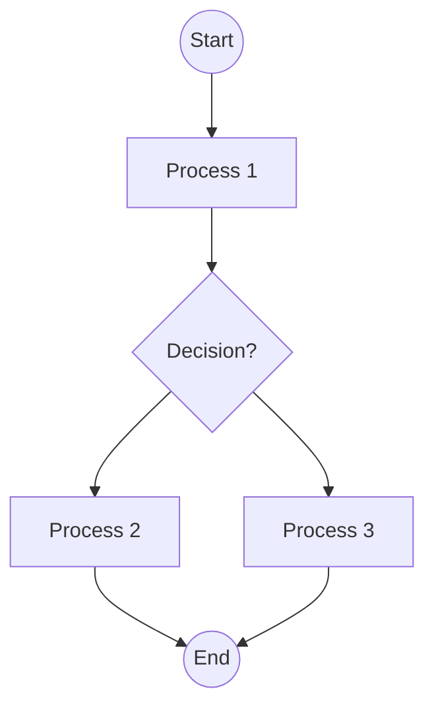

user

## Analyze the flowchart image and convert it to Mermaid syntax.

Follow these requirements strictly:

1. Use proper Mermaid flowchart syntax starting with 'flowchart TD' (top-down) or 'flowchart LR' (left-right)
2. Identify all nodes/boxes and give them appropriate IDs (A, B, C, etc.)
3. Include all decision diamonds with proper syntax using {condition?}
4. Add all connecting arrows and labels using ONLY '-->' (not '-- >' or other variations)
5. Use appropriate node shapes:
   - [Text] for process boxes
   - {Text} for decision diamonds  
   - ((Text)) for start/end circles
   - [Text] for regular rectangles
6. Include all text labels exactly as shown in the image
7. Ensure proper flow direction and connections

IMPORTANT MERMAID SYNTAX RULES:
- Always use '-->' for arrows (never '-- >')
- Node IDs must be followed immediately by node content: A[Process] or B{Decision?}
- Decision nodes use curly braces: {Is condition met?}
- Start/End nodes use double parentheses: ((Start)) or ((End))
- Process nodes use square brackets: [Do something]
- No spaces in arrow syntax: A --> B (not A -- > B)

EXAMPLE:


Provide only the Mermaid code without any additional explanation.assistant

```mermaid
flowchart TD
    A((Start)) --> B[Acquire poster board]
    B --> C[Trace desired designs onto poster board]
    C --> D[Cut out traced shapes to create stencil]
    D --> E[Completed stencil for T-shirt design]
    E --> F{Do you want to dye the T-shirt?}
    F --> G[Do you want to further personalize the T-shirt?]
    G --> H[Customize T-shirt by cutting or poking holes]
    H --> I{Add any additional customizations}
    I --> J[Fully personalized T-shirt with custom modifications]
    J --> K{Position stencil onto one side of T-shirt}
    K --> L[Dyed T-shirt ready for stencil and spray paint]
    L --> M[Position stencil onto one side of T-shirt]
    M --> N[Spray paint lightly over stencil]
    N --> O[T-shirt with spray-painted stencil design]
    O --> P[Place cutout shapes onto the other side of T-shirt]
    P --> Q[Spray paint over the cutout shapes]
    Q --> R[T-shirt with spray-painted cutout design]
    R --> S[End]
    S --> T[Do you want to further personalize the T-shirt?]
    T --> U[Customize T-shirt by cutting or poking holes]
    U --> V{Add any additional customizations}
    V --> W[Fully personalized T-shirt with custom modifications]
    W --> X[Position stencil onto one side of T-shirt]
    X --> Y[Dyed T-shirt ready for stencil and spray paint]
    Y --> Z[Spray paint lightly over stencil]
    Z --> AA[T-shirt with spray-painted stencil design]
    AA --> BB[Place cutout shapes onto the other side of T-shirt]
    BB --> CC[Spray paint over the cutout shapes]
    CC --> DD[T-shirt with spray-painted cutout design]
    DD --> EE[End]
    EE --> FF[Do you want to further personalize the T-shirt?]
    FF --> GG[Customize T-shirt by cutting or poking holes]
    GG --> HH{Add any additional customizations}
    HH --> II[Fully personalized T-shirt with custom modifications]
    II --> JJ[Position stencil onto one side of T-shirt]
    JJ --> KK[Dyed T-shirt ready for stencil and spray paint]
    KK --> LL[Spray paint lightly over stencil]
    LL --> MM[T-shirt with spray-painted stencil design]
    MM --> NN[Place cutout shapes onto the other side of T-shirt]
    NN --> OO[Spray paint over the cutout shapes]
    OO --> PP[T-shirt with spray-painted cutout design]
    PP --> QQ[End]
    QQ --> RR[Do you want to further personalize the T-shirt?]
    RR --> SS[Customize T-shirt by cutting