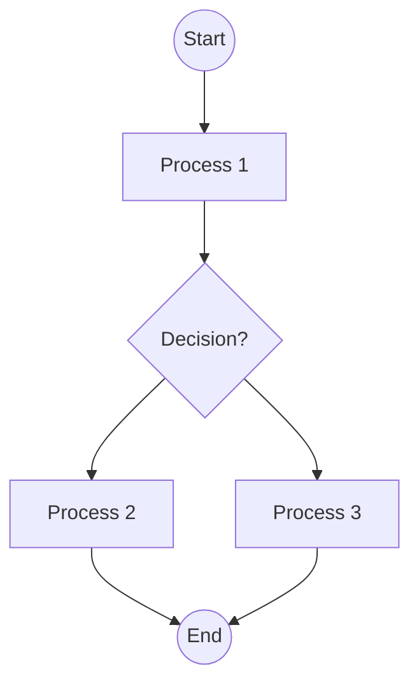

user

## Analyze the flowchart image and convert it to Mermaid syntax.

Follow these requirements strictly:

1. Use proper Mermaid flowchart syntax starting with 'flowchart TD' (top-down) or 'flowchart LR' (left-right)
2. Identify all nodes/boxes and give them appropriate IDs (A, B, C, etc.)
3. Include all decision diamonds with proper syntax using {condition?}
4. Add all connecting arrows and labels using ONLY '-->' (not '-- >' or other variations)
5. Use appropriate node shapes:
   - [Text] for process boxes
   - {Text} for decision diamonds  
   - ((Text)) for start/end circles
   - [Text] for regular rectangles
6. Include all text labels exactly as shown in the image
7. Ensure proper flow direction and connections

IMPORTANT MERMAID SYNTAX RULES:
- Always use '-->' for arrows (never '-- >')
- Node IDs must be followed immediately by node content: A[Process] or B{Decision?}
- Decision nodes use curly braces: {Is condition met?}
- Start/End nodes use double parentheses: ((Start)) or ((End))
- Process nodes use square brackets: [Do something]
- No spaces in arrow syntax: A --> B (not A -- > B)

EXAMPLE:


Provide only the Mermaid code without any additional explanation.assistant

```mermaid
flowchart TD
    A((Start)) --> B[Prepare the soda bottle]
    B --> C{Are some cuts not perfectly straight?}
    C --> D[Measure and mark]
    C --> E[Cut the bottle]
    D --> F[Assemble the hanging mechanism]
    F --> G[Final assembly]
    G --> H[Wind spinner ready]
    H --> I[Angle the strips]
    I --> J[Add details (optional)]
    J --> K[Prepare the bottle cap]
    K --> L[End]
    L --> M[Yes]
    M --> N[No]
    N --> O[End]
    O --> P[Squish and fold]
    P --> Q[Apply tape]
    Q --> R[Measure and mark]
    R --> S[Cut the bottle]
    S --> T[Assemble the hanging mechanism]
    T --> U[Final assembly]
    U --> V[Wind spinner ready]
    V --> W[Angle the strips]
    W --> X[Add details (optional)]
    X --> Y[Prepare the bottle cap]
    Y --> Z[End]
    Z --> AA[Yes]
    AA --> BB[No]
    BB --> CC[End]
    CC --> DD[Squish and fold]
    DD --> EE[Apply tape]
    EE --> FF[Measure and mark]
    FF --> GG[Cut the bottle]
    GG --> HH[Assemble the hanging mechanism]
    HH --> II[Final assembly]
    II --> JJ[Wind spinner ready]
    JJ --> KK[Angle the strips]
    KK --> LL[Add details (optional)]
    LL --> MM[Prepare the bottle cap]
    MM --> NN[End]
    NN --> OO[Yes]
    OO --> PP[No]
    PP --> QQ[End]
    QQ --> RR[Squish and fold]
    RR --> SS[Apply tape]
    SS --> TT[Measure and mark]
    TT --> UU[Cut the bottle]
    UU --> VV[Assemble the hanging mechanism]
    VV --> WW[Final assembly]
    WW --> XX[Wind spinner ready]
    XX --> YY[Angle the strips]
    YY --> ZZ[Add details (optional)]
    ZZ --> AA[Prepare the bottle cap]
    AA --> BB[End]
    BB --> CC[Yes]
    CC --> DD[No]
    DD --> EE[End]
    EE --> FF[Squish and fold]
    FF --> GG[Apply tape]
    GG --> HH[Measure and mark]
    HH --> II[Cut the bottle]
    II --> JJ[Assemble the hanging mechanism]
    JJ --> KK[Final assembly]
    KK --> LL[Wind spinner ready]
    LL --> MM[Angle the strips]
    MM --> NN[Add details (optional)]
    NN --> OO[Prepare the bottle cap]
    OO -->