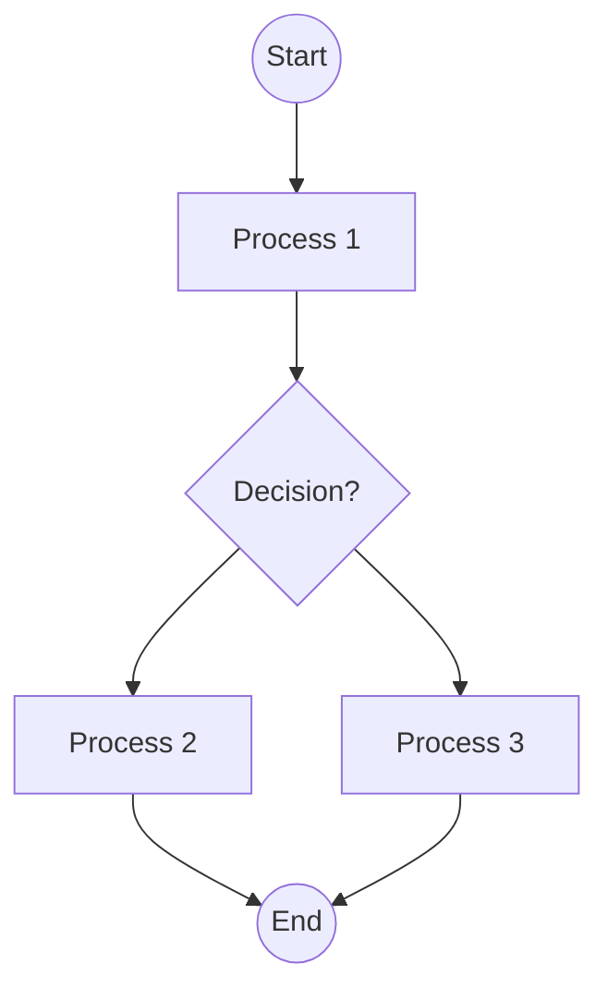

user

## Analyze the flowchart image and convert it to Mermaid syntax.

Follow these requirements strictly:

1. Use proper Mermaid flowchart syntax starting with 'flowchart TD' (top-down) or 'flowchart LR' (left-right)
2. Identify all nodes/boxes and give them appropriate IDs (A, B, C, etc.)
3. Include all decision diamonds with proper syntax using {condition?}
4. Add all connecting arrows and labels using ONLY '-->' (not '-- >' or other variations)
5. Use appropriate node shapes:
   - [Text] for process boxes
   - {Text} for decision diamonds  
   - ((Text)) for start/end circles
   - [Text] for regular rectangles
6. Include all text labels exactly as shown in the image
7. Ensure proper flow direction and connections

IMPORTANT MERMAID SYNTAX RULES:
- Always use '-->' for arrows (never '-- >')
- Node IDs must be followed immediately by node content: A[Process] or B{Decision?}
- Decision nodes use curly braces: {Is condition met?}
- Start/End nodes use double parentheses: ((Start)) or ((End))
- Process nodes use square brackets: [Do something]
- No spaces in arrow syntax: A --> B (not A -- > B)

EXAMPLE:


Provide only the Mermaid code without any additional explanation.assistant

```mermaid
flowchart TD
    A((Start)) --> B[Position yourself on the mat]
    B --> C{Position yourself on the mat}
    C --> D[Lift buttocks, hips, and back]
    D --> E[Support your back with elbows and hands]
    E --> F{Adjust elbows and upper arms to be flat}
    F --> G[Move hands closer to shoulder blades]
    G --> H[Press down with elbows and hands]
    H --> I[Body alignment ready for full pose]
    I --> J{Can support weight without straining?}
    J --> K[Lift heels upwards]
    K --> L[Position toes over nose, sternum toward chin]
    L --> M{Feel any strain in neck?}
    M --> N{Wish to repeat the pose?}
    N --> O[End Pose Sequence sternum toward chin]
    O --> P[Place hands on floor, Complete]
    P --> Q{Hold posture for 30 to 60 seconds]
    Q --> R[Lower spine gradually]
    R --> S[Gently lower legs to floor]
    S --> T{Rest for up to 60 seconds]
    T --> U[End Pose Sequence sternum toward chin]
    U --> V[Complete]
    V --> W[Feel any strain in neck?]
    W --> X{Wish to repeat the pose?}
    X --> Y[End Pose and Rest]
    Y --> Z[Full shoulder stand pose achieved]
    Z --> AA[Hold posture for 30 to 60 seconds]
    AA --> BB[Place hands on floor, Complete]
    BB --> CC[Lower spine gradually]
    CC --> DD[Gently lower legs to floor]
    DD --> EE[Rest for up to 60 seconds]
    EE --> FF[End Pose Sequence sternum toward chin]
    FF --> GG[Complete]
    GG --> HH[Feel any strain in neck?]
    HH --> II{Wish to repeat the pose?}
    II --> JJ[End Pose and Rest]
    JJ --> KK[Full shoulder stand pose achieved]
    KK --> LL[Hold posture for 30 to 60 seconds]
    LL --> MM[Place hands on floor, Complete]
    MM --> NN[Lower spine gradually]
    NN --> OO[Gently lower legs to floor]
    OO --> PP[Rest for up to 60 seconds]
    PP --> QQ[End Pose Sequence sternum toward chin]
    QQ --> RR[Complete]
    RR --> SS[Feel any strain in neck?]
    SS --> TT{Wish to repeat the pose?}
    TT --> UU[End Pose and Rest]
    UU --> VV[Full shoulder stand pose achieved]
    VV --> WW[Hold posture for 30 to 60 seconds]
    WW --> XX[Place hands on floor, Complete]
    XX --> YY[Lower