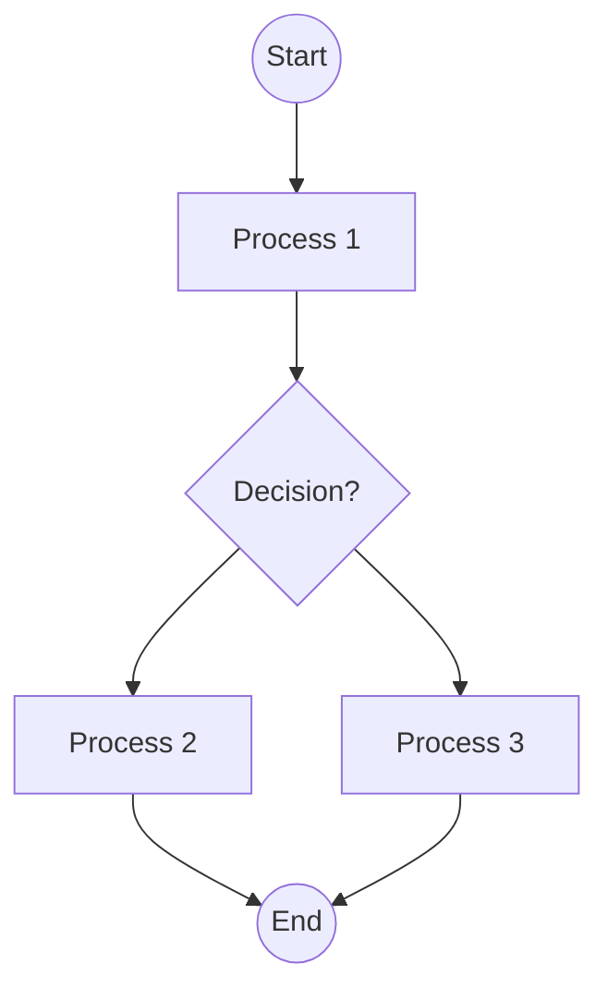

user

## Analyze the flowchart image and convert it to Mermaid syntax.

Follow these requirements strictly:

1. Use proper Mermaid flowchart syntax starting with 'flowchart TD' (top-down) or 'flowchart LR' (left-right)
2. Identify all nodes/boxes and give them appropriate IDs (A, B, C, etc.)
3. Include all decision diamonds with proper syntax using {condition?}
4. Add all connecting arrows and labels using ONLY '-->' (not '-- >' or other variations)
5. Use appropriate node shapes:
   - [Text] for process boxes
   - {Text} for decision diamonds  
   - ((Text)) for start/end circles
   - [Text] for regular rectangles
6. Include all text labels exactly as shown in the image
7. Ensure proper flow direction and connections

IMPORTANT MERMAID SYNTAX RULES:
- Always use '-->' for arrows (never '-- >')
- Node IDs must be followed immediately by node content: A[Process] or B{Decision?}
- Decision nodes use curly braces: {Is condition met?}
- Start/End nodes use double parentheses: ((Start)) or ((End))
- Process nodes use square brackets: [Do something]
- No spaces in arrow syntax: A --> B (not A -- > B)

EXAMPLE:


Provide only the Mermaid code without any additional explanation.assistant

```mermaid
flowchart TD
    A((Start)) --> B[Input: 'n', the position of the smart number to find.]
    B --> C[Initialize 'MAX' to 3000.]
    C --> D[Initialize 'primes' as a list of zeros with length 'MAX'.]
    D --> E[Initialize'result' as an empty list.]
    E --> F[Loop 'i' from 2 to 'MAX - 1'.]
    F --> G{Is 'primes[i]' equal to 0?}
    G --> H[Set 'primes[i]' to 1]
    H --> I[Initialize 'j' to 'i' + 2]
    I --> J[Loop while 'j' is less than 'MAX'.]
    J --> K{Is '(primes[j] + 3)' equal to 0?}
    K --> L[Append 'j' to'result']
    L --> M{Increment 'j' by 1}
    M --> N[Sort the'result' list]
    N --> O{Is 'n - 1' within the bounds of'result'?}
    O --> P[Return'result[n - 1]']
    P --> Q[Handle the error or return an invalid value.]
    Q --> R((End))
    R --> A
```