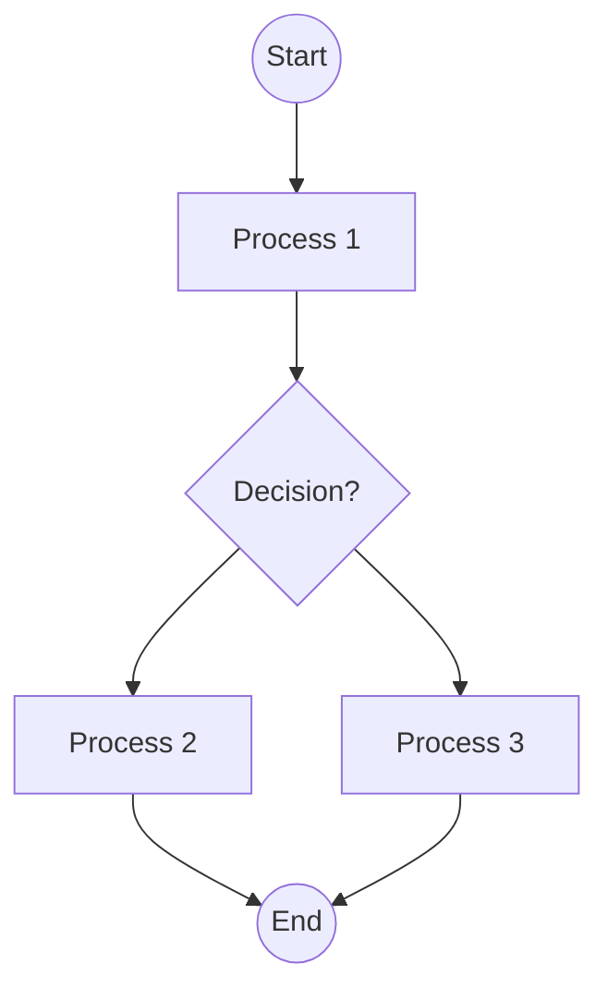

user

## Analyze the flowchart image and convert it to Mermaid syntax.

Follow these requirements strictly:

1. Use proper Mermaid flowchart syntax starting with 'flowchart TD' (top-down) or 'flowchart LR' (left-right)
2. Identify all nodes/boxes and give them appropriate IDs (A, B, C, etc.)
3. Include all decision diamonds with proper syntax using {condition?}
4. Add all connecting arrows and labels using ONLY '-->' (not '-- >' or other variations)
5. Use appropriate node shapes:
   - [Text] for process boxes
   - {Text} for decision diamonds  
   - ((Text)) for start/end circles
   - [Text] for regular rectangles
6. Include all text labels exactly as shown in the image
7. Ensure proper flow direction and connections

IMPORTANT MERMAID SYNTAX RULES:
- Always use '-->' for arrows (never '-- >')
- Node IDs must be followed immediately by node content: A[Process] or B{Decision?}
- Decision nodes use curly braces: {Is condition met?}
- Start/End nodes use double parentheses: ((Start)) or ((End))
- Process nodes use square brackets: [Do something]
- No spaces in arrow syntax: A --> B (not A -- > B)

EXAMPLE:


Provide only the Mermaid code without any additional explanation.assistant

```mermaid
flowchart TD
    A((Start)) --> B[Process 1]
    B --> C{Is the event potentially date-like?}
    C --> D[Process 2]
    C --> E[Process 3]
    D --> F{Emphasize the group nature of the event}
    F --> G[Process 4]
    G --> H{Proceed with the invitatio}
    H --> I[Process 5]
    I --> J{The guy receives a group event invitation}
    J --> K{Respond to solo hangout requests by redirecting}
    K --> L[Process 6]
    L --> M{Does the guy ask for a solo hangout?}
    M --> N[Process 7]
    N --> O{Suggest joining an existing group plan}
    O --> P{Do you engage in casual touch?}
    P --> Q{Avoid these gestures with the guy}
    Q --> R{Continue with usual behavior}
    R --> S{Reduce physical contact sends a clear signal}
    S --> T{Moderate compliments to avoid flirtation}
    T --> U{Observe the situation for compliments}
    U --> V{Is the compliment potentially flirtatious?}
    V --> W{Choose a less flirty comment or forgo}
    W --> X{Give the compliment as usual}
    X --> Y{Handle flirtatious behavior appropriately}
    Y --> Z{Is the guy flirting?}
    Z --> AA{Does the flirtation make you uncomfortable?}
    AA --> BB{Address behavior and set boundaries}
    BB --> CC{Respond with neutral acknowledgement}
    CC --> DD{Flirtation is neutralized or boundaries set}
    DD --> EE{Continue normal Interactio}
    EE --> FF{End}
    FF --> GG{Does the guy ask for a solo hangout?}
    GG --> HH{Does the guy ask for a solo hangout?}
    HH --> II{Does the guy ask for a solo hangout?}
    II --> JJ{Does the guy ask for a solo hangout?}
    JJ --> KK{Does the guy ask for a solo hangout?}
    KK --> LL{Does the guy ask for a solo hangout?}
    LL --> MM{Does the guy ask for a solo hangout?}
    MM --> NN{Does the guy ask for a solo hangout?}
    NN --> OO{Does the guy ask for a solo hangout?}
    OO --> PP{Does the guy ask for a solo hangout?}
    PP --> QQ{Does the guy ask for a solo hangout?}
    QQ --> RR{Does the guy ask for a solo hangout?}
    RR --> SS{Does the guy ask for a solo hangout?}
    SS --> TT{Does the guy ask for a solo hangout?}
    TT