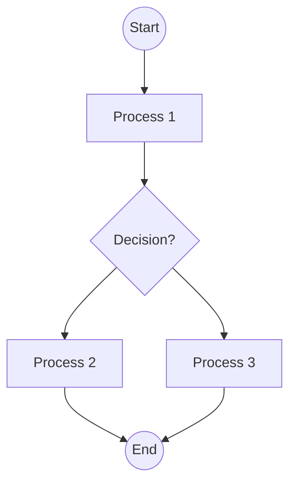

user

## Analyze the flowchart image and convert it to Mermaid syntax.

Follow these requirements strictly:

1. Use proper Mermaid flowchart syntax starting with 'flowchart TD' (top-down) or 'flowchart LR' (left-right)
2. Identify all nodes/boxes and give them appropriate IDs (A, B, C, etc.)
3. Include all decision diamonds with proper syntax using {condition?}
4. Add all connecting arrows and labels using ONLY '-->' (not '-- >' or other variations)
5. Use appropriate node shapes:
   - [Text] for process boxes
   - {Text} for decision diamonds  
   - ((Text)) for start/end circles
   - [Text] for regular rectangles
6. Include all text labels exactly as shown in the image
7. Ensure proper flow direction and connections

IMPORTANT MERMAID SYNTAX RULES:
- Always use '-->' for arrows (never '-- >')
- Node IDs must be followed immediately by node content: A[Process] or B{Decision?}
- Decision nodes use curly braces: {Is condition met?}
- Start/End nodes use double parentheses: ((Start)) or ((End))
- Process nodes use square brackets: [Do something]
- No spaces in arrow syntax: A --> B (not A -- > B)

EXAMPLE:


Provide only the Mermaid code without any additional explanation.assistant

```mermaid
flowchart TD
    A((Start)) --> B[Identify Hiding Spots]
    B --> C{Acquire Cat Treats}
    C --> D[Hide Treats Under Furniture]
    D --> E{Hide Treats Behind Drapes}
    E --> F[Hide Treats Under Bedspread/Blanket]
    F --> G{Hide Treats Near Scratching/Climbing Posts}
    G --> H{Multiple Scratching/Climbing Posts?}
    H --> I[Hide Treats on Each Post]
    I --> J[Hide Treats in Baskets and Drawers]
    J --> K[Hide Treats in Cupboards]
    K --> L{Unsafe Spots to Consider?}
    L --> M{Identify Unsafe Hiding Spots}
    M --> N{Safe Hiding Spot List}
    N --> O{Avoid Unsafe Hiding Spots}
    O --> P((End))
    P --> Q{Hide Treats in Baskets and Drawers}
    Q --> R{Hide Treats in Cupboards}
    R --> S{Hide Treats on Each Post}
    S --> T{Hide Treats Under Bedspread/Blanket}
    T --> U{Hide Treats Behind Drapes}
    U --> V{Hide Treats Under Furniture}
    V --> W{Acquire Cat Treats}
    W --> X{Identify Hiding Spots}
    X --> Y{Start}
    Y --> Z{Multiple Scratching/Climbing Posts?}
    Z --> AA{Hide Treats on Each Post}
    AA --> BB{Hide Treats in Baskets and Drawers}
    BB --> CC{Hide Treats in Cupboards}
    CC --> DD{Unsafe Spots to Consider?}
    DD --> EE{Identify Unsafe Hiding Spots}
    EE --> FF{Safe Hiding Spot List}
    FF --> GG{Avoid Unsafe Hiding Spots}
    GG --> HH((End))
    HH --> II{Hide Treats in Baskets and Drawers}
    II --> JJ{Hide Treats in Cupboards}
    JJ --> KK{Hide Treats on Each Post}
    KK --> LL{Hide Treats Under Bedspread/Blanket}
    LL --> MM{Hide Treats Behind Drapes}
    MM --> NN{Hide Treats Under Furniture}
    NN --> OO{Acquire Cat Treats}
    OO --> PP{Identify Hiding Spots}
    PP --> QQ{Start}
    QQ --> RR{Multiple Scratching/Climbing Posts?}
    RR --> SS{Hide Treats on Each Post}
    SS --> TT{Hide Treats in Baskets and Drawers}
    TT --> UU{Hide Treats in Cupboards}
    UU --> VV{Unsafe Spots to Consider?}
    VV --> WW{Identify Unsafe Hiding Spots}
