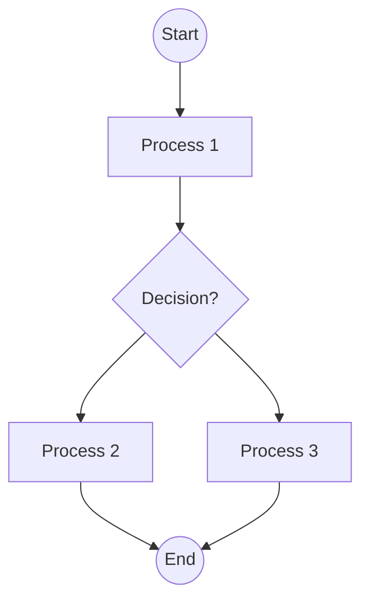

user

## Analyze the flowchart image and convert it to Mermaid syntax.

Follow these requirements strictly:

1. Use proper Mermaid flowchart syntax starting with 'flowchart TD' (top-down) or 'flowchart LR' (left-right)
2. Identify all nodes/boxes and give them appropriate IDs (A, B, C, etc.)
3. Include all decision diamonds with proper syntax using {condition?}
4. Add all connecting arrows and labels using ONLY '-->' (not '-- >' or other variations)
5. Use appropriate node shapes:
   - [Text] for process boxes
   - {Text} for decision diamonds  
   - ((Text)) for start/end circles
   - [Text] for regular rectangles
6. Include all text labels exactly as shown in the image
7. Ensure proper flow direction and connections

IMPORTANT MERMAID SYNTAX RULES:
- Always use '-->' for arrows (never '-- >')
- Node IDs must be followed immediately by node content: A[Process] or B{Decision?}
- Decision nodes use curly braces: {Is condition met?}
- Start/End nodes use double parentheses: ((Start)) or ((End))
- Process nodes use square brackets: [Do something]
- No spaces in arrow syntax: A --> B (not A -- > B)

EXAMPLE:


Provide only the Mermaid code without any additional explanation.assistant

```mermaid
flowchart TD
    A((Start)) --> B[Identify need to move the plant]
    B --> C{Can planting or moving on the plant?}
    C --> D[Consider plant's location]
    D --> E{Is location within cat's reach?}
    E --> F{Create new location for cat plant?}
    F --> G{Can the plant be moved from the cutting?}
    G --> H{Is there an alternative high location?}
    H --> I{Is there a cat-free area?}
    I --> J[Make an area off limits to the cat]
    J --> K[Can the cat be trained?]
    K --> L{Train the cat}
    L --> M[After relocating, is plant a threat?]
    M --> N{Ensure plant is secure in new location}
    N --> O[Consider additional safety measures]
    O --> P{Use positive reinforcement and correction}
    P --> Q[Implement barriers to prevent cat access]
    Q --> R{Move plant to cat-free area}
    R --> S[Secure the plant safely]
    S --> T{Ensure plant is secure in new location}
    T --> U[Consider additional safety measures]
    U --> V{Use positive reinforcement and correction}
    V --> W[Implement barriers to prevent cat access]
    W --> X[Is the plant toxic and can drop leaves?]
    X --> Y[Place plant so high location]
    Y --> Z[Is the plant toxic and can drop leaves?]
    Z --> AA[Consider additional safety measures]
    AA --> BB[Use positive reinforcement and correction]
    BB --> CC[Implement barriers to prevent cat access]
    CC --> DD[Move plant to cat-free area]
    DD --> EE[Secure the plant safely]
    EE --> FF[Ensure plant is secure in new location]
    FF --> GG[Consider additional safety measures]
    GG --> HH[Use positive reinforcement and correction]
    HH --> II[Implement barriers to prevent cat access]
    II --> JJ[Move plant to cat-free area]
    JJ --> KK[Secure the plant safely]
    KK --> LL[Ensure plant is secure in new location]
    LL --> MM[Consider additional safety measures]
    MM --> NN[Use positive reinforcement and correction]
    NN --> OO[Implement barriers to prevent cat access]
    OO --> PP[Move plant to cat-free area]
    PP --> QQ[Secure the plant safely]
    QQ --> RR[Ensure plant is secure in new location]
    RR --> SS[Consider additional safety measures]
    SS --> TT[Use positive reinforcement and correction]
    TT --> UU[Implement barriers to prevent cat access]
    UU --> VV[Move plant to cat-free area]
    VV --> WW[Secure the plant safely]
    WW --> XX[Ensure plant is secure in new location]
    XX --> YY