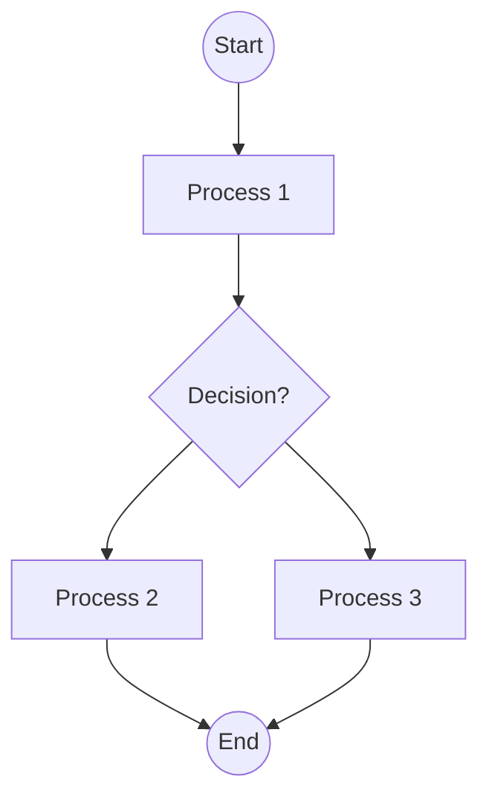

user

## Analyze the flowchart image and convert it to Mermaid syntax.

Follow these requirements strictly:

1. Use proper Mermaid flowchart syntax starting with 'flowchart TD' (top-down) or 'flowchart LR' (left-right)
2. Identify all nodes/boxes and give them appropriate IDs (A, B, C, etc.)
3. Include all decision diamonds with proper syntax using {condition?}
4. Add all connecting arrows and labels using ONLY '-->' (not '-- >' or other variations)
5. Use appropriate node shapes:
   - [Text] for process boxes
   - {Text} for decision diamonds  
   - ((Text)) for start/end circles
   - [Text] for regular rectangles
6. Include all text labels exactly as shown in the image
7. Ensure proper flow direction and connections

IMPORTANT MERMAID SYNTAX RULES:
- Always use '-->' for arrows (never '-- >')
- Node IDs must be followed immediately by node content: A[Process] or B{Decision?}
- Decision nodes use curly braces: {Is condition met?}
- Start/End nodes use double parentheses: ((Start)) or ((End))
- Process nodes use square brackets: [Do something]
- No spaces in arrow syntax: A --> B (not A -- > B)

EXAMPLE:


Provide only the Mermaid code without any additional explanation.assistant

```mermaid
flowchart TD
    A((Start)) --> B[Engage in Activities to Distract from the Wait]
    B --> C[Make Christmas Crafts or Cookies]
    C --> D[Help Wrap Gifts]
    D --> E[Read a Long Book]
    E --> F{Enjoyable Activity?}
    F --> G[Continue with Other Activities]
    G --> H{Track Time Until Christmas]
    H --> I[Calendar or App]
    I --> J[Tracking Tool]
    J --> K{Sense of Progress?}
    K --> L[Admitting Excitement for Christmas?]
    L --> M[Downplay Excitement]
    M --> N[Longer Patience]
    N --> O[Schoolwork, Chores]
    O --> P[Obligations]
    P --> Q{Sense of Accomplishment?}
    Q --> R[Ensure Adequate Sleep]
    R --> S[Less Time Waiting]
    S --> T[Start Christmas Preparations]
    T --> U[Read Articles on Falling Asleep]
    U --> V[Bore Yourself Until You Sleep]
    V --> W{Exhaustion Leading to Sleep?}
    W --> X[Treat High as Normal and Rest]
    X --> Y{Enjoy Christmas?}
    Y --> Z[Wind Occasioned with Festive Preparation]
    Z --> AA[Engage in Joyful Expression]
    AA --> BB[Feelings of Happiness and Joy]
    BB --> CC[Document Your Excitement and Reflections]
    CC --> DD[Book, Journal, Pictures]
    DD --> EE[Reflection Materials]
    EE --> FF[Documented Memories]
    FF --> GG[Struggling to Sleep Due to Excitement?]
    GG --> HH[Engage in Physical Activity or Relaxation]
    HH --> II[Run, Jump, or Do Activities]
    II --> JJ[End]
    JJ --> KK((End))
    KK --> LL[Read Articles on Falling Asleep]
    LL --> MM[Bore Yourself Until You Sleep]
    MM --> NN{Exhaustion Leading to Sleep?}
    NN --> OO[Treat High as Normal and Rest]
    OO --> PP{Enjoy Christmas?}
    PP --> QQ[Wind Occasioned with Festive Preparation]
    QQ --> RR[Engage in Joyful Expression]
    RR --> SS[Feelings of Happiness and Joy]
    SS --> TT[Document Your Excitement and Reflections]
    TT --> UU[Book, Journal, Pictures]
    UU --> VV[Reflection Materials]
    VV --> WW[Documented Memories]
    WW --> XX[Struggling to Sleep Due to Excitement?]
    XX --> YY[Engage in Physical Activity or Relaxation]
    YY --> ZZ[Run, Jump, or Do Activities]
    ZZ --> ((End))
```