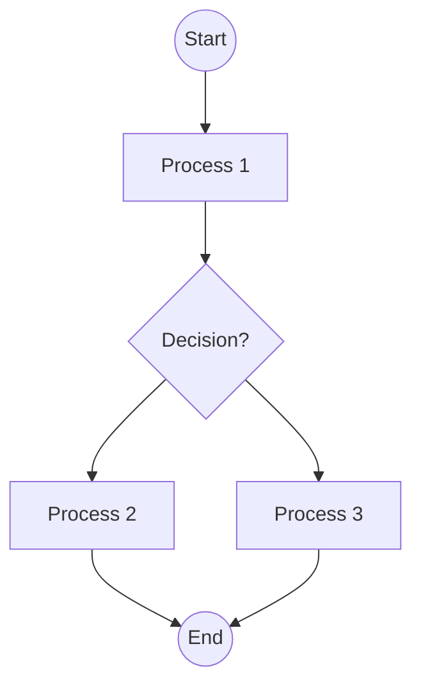

user

## Analyze the flowchart image and convert it to Mermaid syntax.

Follow these requirements strictly:

1. Use proper Mermaid flowchart syntax starting with 'flowchart TD' (top-down) or 'flowchart LR' (left-right)
2. Identify all nodes/boxes and give them appropriate IDs (A, B, C, etc.)
3. Include all decision diamonds with proper syntax using {condition?}
4. Add all connecting arrows and labels using ONLY '-->' (not '-- >' or other variations)
5. Use appropriate node shapes:
   - [Text] for process boxes
   - {Text} for decision diamonds  
   - ((Text)) for start/end circles
   - [Text] for regular rectangles
6. Include all text labels exactly as shown in the image
7. Ensure proper flow direction and connections

IMPORTANT MERMAID SYNTAX RULES:
- Always use '-->' for arrows (never '-- >')
- Node IDs must be followed immediately by node content: A[Process] or B{Decision?}
- Decision nodes use curly braces: {Is condition met?}
- Start/End nodes use double parentheses: ((Start)) or ((End))
- Process nodes use square brackets: [Do something]
- No spaces in arrow syntax: A --> B (not A -- > B)

EXAMPLE:


Provide only the Mermaid code without any additional explanation.assistant

```mermaid
flowchart TD
    A((Start)) --> B[Pre-bake the crust for 10 minutes]
    B --> C{Gather ingredients for pizza dough and toppings}
    C --> D[Combine flour, yeast, salt, olive oil, and hot water]
    D --> E{Mix with mixer until moist and chunky}
    E --> F[Use hands to fold the dough into a ball]
    F --> G{Place dough on a lightly floured surface}
    G --> H[Knead the dough for 10 minutes]
    H --> I[Cover the dough and let it rest for 10 minutes]
    I --> J[Add pesto to the pan]
    J --> K[Cut chicken breast into cubes and add to the pan]
    K --> L[Sauté chicken on medium heat for 5 minutes]
    L --> M[Roll out the pizza dough]
    M --> N[Prepare the pizza pan with olive oil]
    N --> O[Place dough on the pizza pan]
    O --> P[Turn and fold edges to form the crust]
    P --> Q[Preheat the oven to 400 degrees Fahrenheit]
    Q --> R[Spread olive oil over the crust]
    R --> S[Poke holes in the crust with a fork]
    S --> T[Add the pesto chicken]
    T --> U[Spread pizza sauce evenly]
    U --> V[Spread cheese evenly]
    V --> W[Add the pesto chicken]
    W --> X[Bake the pizza at 400 degrees for 15-20 minutes]
    X --> Y[Cut the pizza into slices]
    Y --> Z[Prepare the pizza pan with olive oil]
    Z --> ((End))
```